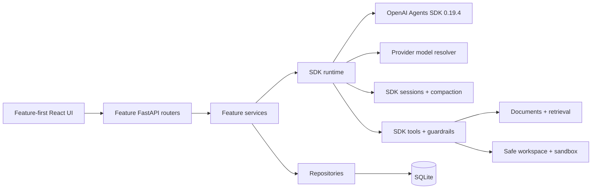

# ScholarWeave

**A local-first research workspace built directly on the OpenAI Agents SDK.**

ScholarWeave combines PDF ingestion, OCR, retrieval, SDK-native agent composition, and a visual
authoring canvas in one self-hosted application. It supports local Ollama models, OpenAI, Azure
OpenAI, Azure AI Foundry, and OpenAI-compatible endpoints.

## Capabilities

| Area | Capabilities |
| --- | --- |
| **Papers** | Upload PDFs, extract text and figures, OCR text-poor pages, index chunks, and inspect page-level quality. |
| **Agents** | Compose SDK `Agent`, `FunctionTool`, hosted tool, `Agent.as_tool()`, handoff, guardrail, structured-output, and model-setting primitives. |
| **Builder chat** | Create and revise validated SDK blueprints through an ordinary SDK agent with a persistent SDK session, visible stepwise TODOs, and save-receipt completion. |
| **Tools** | Use built-in research/workspace tools or author revisioned sandboxed Python `FunctionTool` callbacks. |
| **Runs** | Inspect SDK run items, tool calls, handoffs, guardrails, usage, interruptions, compaction, and streamed lifecycle events. |
| **Workspace** | Read and write safe local text artifacts without exposing arbitrary filesystem access. |

## Runtime model

ScholarWeave does not implement a separate graph executor. The canvas is a presentation layer over
an `AgentBlueprint`, which is compiled into real SDK objects:

- Each autonomous component is an SDK `Agent`.
- Capabilities are SDK `FunctionTool` or hosted-tool instances.
- Delegation uses `handoff()` or `Agent.as_tool()`.
- Validation uses SDK input, output, tool-input, and tool-output guardrails.
- Every execution uses SDK `Runner`.
- Pause and resume use serialized SDK `RunState`.
- Runtime observations are projections of SDK run items, hooks, and stream events.

Canvas coordinates are stored separately and never affect execution. There are no generic nodes,
ports, data-flow edges, conditions, or application-owned orchestration phases.

## Sessions, context, and compaction

Model-visible conversation history is owned exclusively by the SDK `Session` contract:

- Conversations use one SQLite-backed SDK session each.
- Genuine OpenAI Responses models can use `OpenAIResponsesCompactionSession`.
- Local and compatible models use a `Session` decorator whose compactor is itself an SDK agent.
- Compaction replaces old history with a valid SDK assistant summary plus a protected recent tail.
- Removed history is not retained in a hidden parallel transcript.
- The chat UI renders a stable compaction marker when replacement occurs.

`ScholarWeaveContext` carries live repositories, IDs, services, and event sinks through
`RunContextWrapper`. Local context is not added to model input unless instructions or a tool
deliberately expose data.

## Architecture



The backend is organized by feature under `backend/agents`, `builder`, `conversations`,
`documents`, `providers`, `runs`, `tools`, and `workspace`. `backend/bootstrap.py` is the
composition root. The frontend mirrors those features under `frontend/src/features`; API types are
generated from FastAPI OpenAPI rather than maintained manually.

## Quick start

### Prerequisites

- Python 3.12+
- Node.js 20+
- [Ollama](https://ollama.com/) for a local setup, or credentials for another supported provider
- Tesseract OCR and the required language pack for scanned PDFs, or an NVIDIA GPU for Surya OCR 2

On Ubuntu or Debian:

```bash
sudo apt install tesseract-ocr tesseract-ocr-eng
```

For a local setup, pull chat/tool and embedding models:

```bash
ollama pull llama3.1:8b
ollama pull nomic-embed-text
```

The selected agent model must support tool calling when its blueprint binds tools.

### Install and run

```bash
git clone https://github.com/giridharmunagala/scholarweave.git
cd scholarweave

python3.12 -m venv .venv
.venv/bin/pip install -r requirements.txt

cd frontend
npm ci
npm run build
cd ..

.venv/bin/uvicorn backend.app:app --host 127.0.0.1 --port 8000
```

When enabling Surya on an NVIDIA system, install the CUDA PyTorch wheel that matches the host
driver. For CUDA 13:

```bash
.venv/bin/pip install --upgrade --index-url https://download.pytorch.org/whl/cu130 torch torchvision
```

Open <http://127.0.0.1:8000>, configure provider defaults under **Settings**, ingest papers under
**Papers**, then create an SDK blueprint under **Agents** or through **Builder chat**.

## Providers

Provider profiles are resolved through the SDK model boundary:

- OpenAI profiles use `OpenAIResponsesModel`.
- Ollama and OpenAI-compatible profiles use `OpenAIChatCompletionsModel`.
- Azure OpenAI and Azure AI Foundry use their supported OpenAI clients.
- Provider capabilities are checked when a blueprint compiles; unsupported hosted tools or model
  features fail validation rather than degrading silently.

API keys are stored only in the local SQLite database, are masked by API responses, and are never
included in Python exports.

## OCR and retrieval

PDF ingestion extracts embedded text and OCRs text-poor pages with either Tesseract or
`datalab-to/surya-ocr-2`. Surya is loaded directly from Hugging Face in an isolated process; resident
Ollama models can be unloaded first, and process exit releases Surya's CUDA allocation after each
job. Optional vision models can rewrite poor pages after OCR. Documents are chunked for keyword and
vector retrieval; agents access that data through typed SDK tools instead of implicit prompt
injection. Surya's weights use a modified OpenRAIL-M license; review its Hugging Face model card for
commercial-use terms.

## Local data and cutover

| Path | Contents |
| --- | --- |
| `local_data/metadata.sqlite3` | Settings, provider profiles, SDK blueprints, custom tools, conversations, runs, documents, and vectors |
| `local_data/documents/` | Uploaded PDFs |
| `local_data/artifacts/` | Extracted content, figures, and generated artifacts |
| `local_data/llm_calls.jsonl` | Credential-redacted model request audit log |
| `workspace/` | Safe text files available through workspace tools |

On the first SDK-schema startup, ScholarWeave creates a timestamped
`metadata.pre-sdk-*.sqlite3` backup, removes incompatible runtime records, and preserves providers,
documents, chunks, and artifacts. Old graph definitions, node runs, builder plans, and Markdown
memory are intentionally not migrated.

Settings can also be provided through `SCHOLARWEAVE_` environment variables, for example:

```bash
SCHOLARWEAVE_OLLAMA_BASE_URL=http://127.0.0.1:11434
SCHOLARWEAVE_AGENT_COMPACTION_THRESHOLD_ITEMS=30
```

## Development

```bash
# API with reload
.venv/bin/uvicorn backend.app:app --reload --port 8000

# Frontend development server
cd frontend && npm run dev

# Generate API contracts
cd frontend && npm run generate:api

# Verify committed contracts have no backend drift
cd frontend && npm run check:api

# Checks
pytest
cd frontend && npm test && npm run build
```

`openai-agents==0.19.4` and `openapi-typescript==7.13.0` are exact pins. SDK upgrades are explicit
compatibility work and should update contract tests and generated API types together.

## Security

Protect `local_data/metadata.sqlite3` with normal filesystem permissions; it is not encrypted.
Sandboxed Python tools run in an isolated subprocess with network blocking, an import allowlist,
timeout, and CPU/memory limits. This protects against mistakes but is not a hardened security
boundary, so disable Python tools when untrusted users can author tool code.
