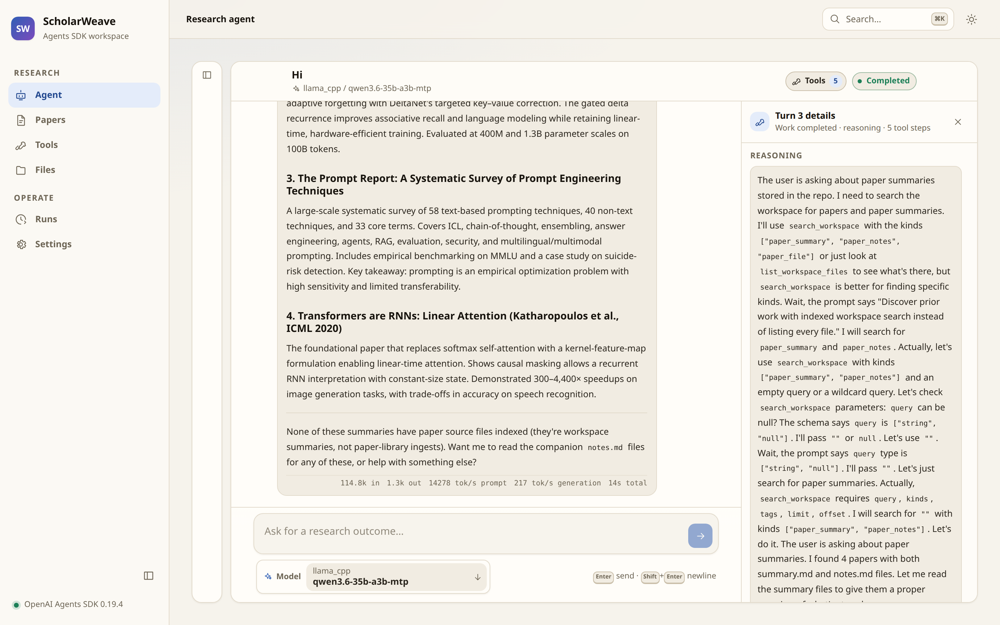
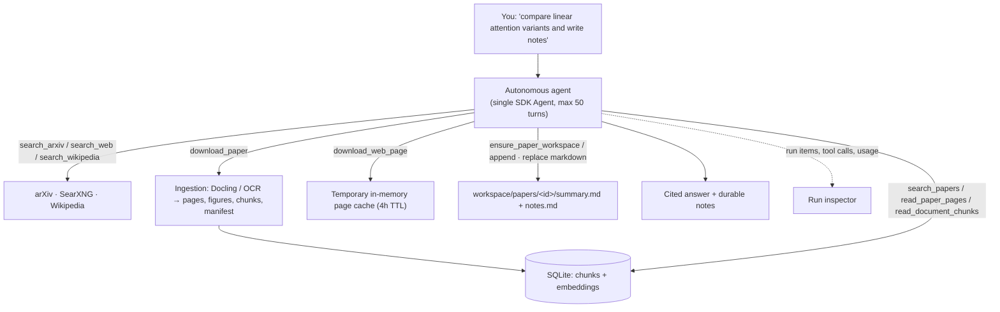
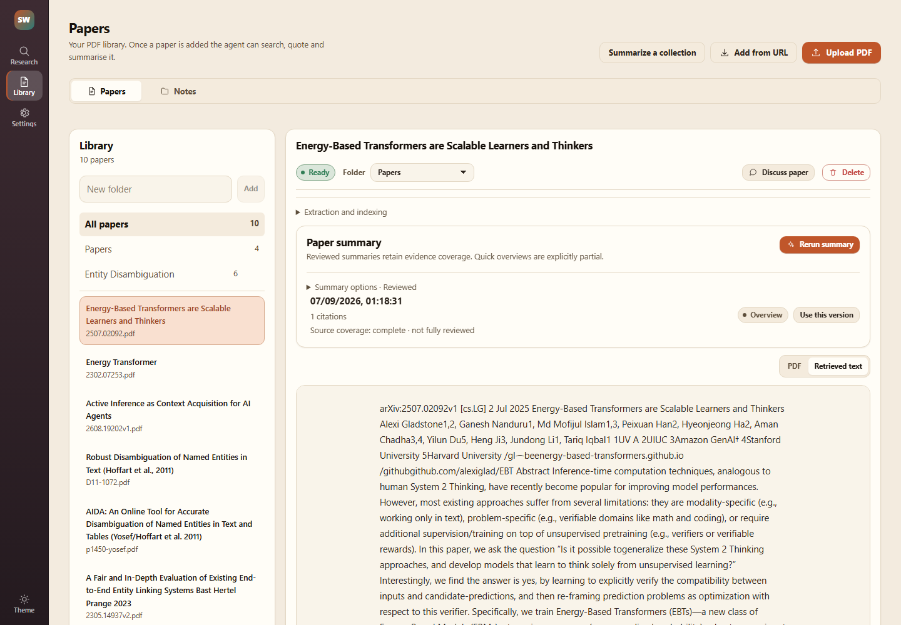
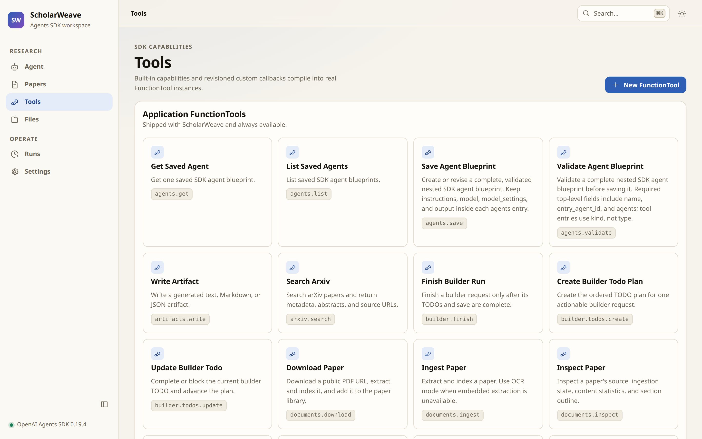
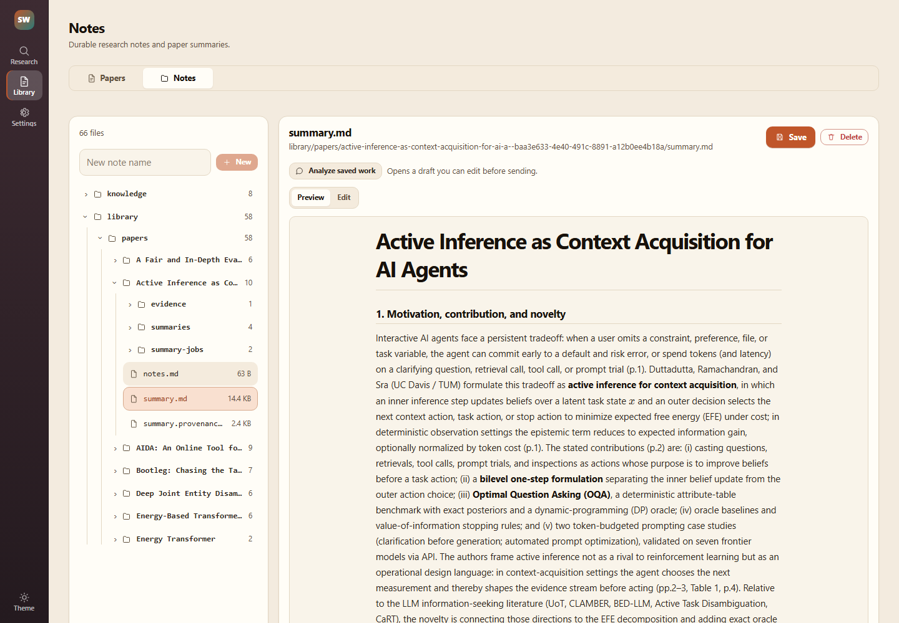
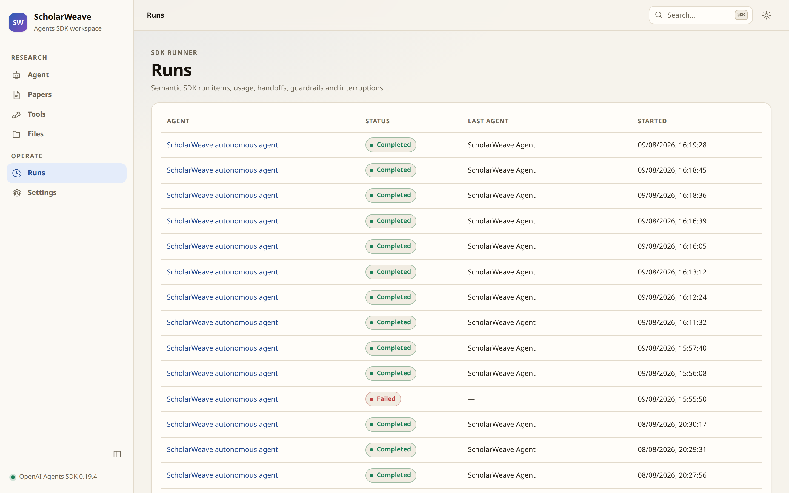
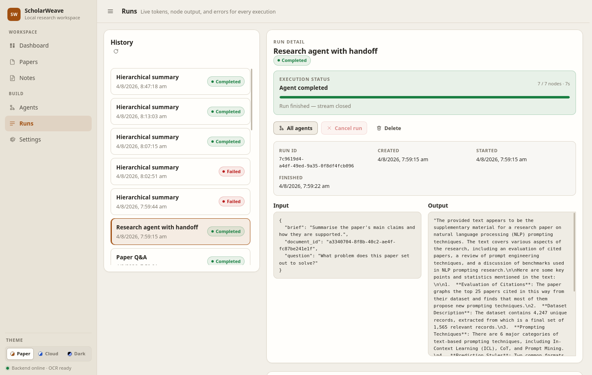
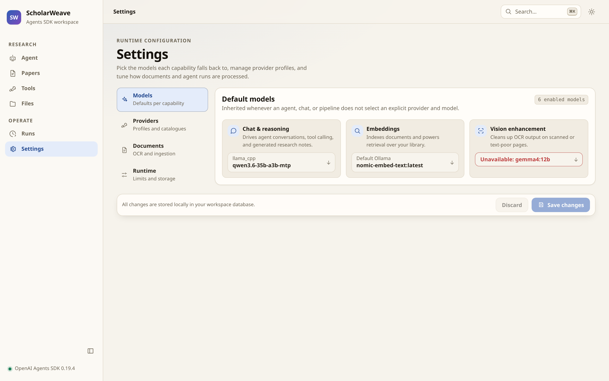
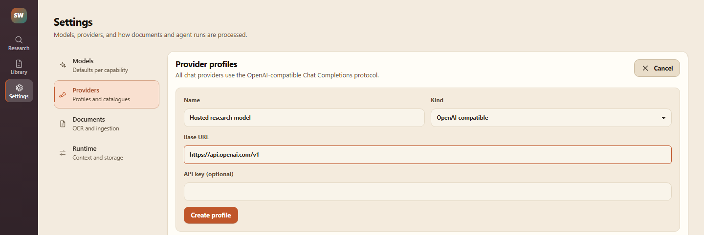
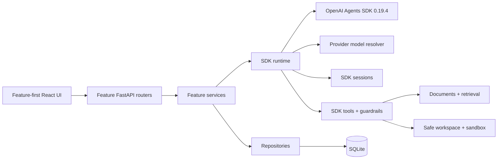

# ScholarWeave

**A local-first autonomous research agent, built directly on the OpenAI Agents SDK.**

ScholarWeave is a self-hosted research workspace: you point it at PDFs and the open web, it
ingests and indexes them, and an autonomous agent does the actual work — searching, reading
primary text, tracing evidence, computing exact results, and writing durable, cited notes into
a local workspace. Direct chat uses one agent; optional Extended work uses the same selected
model in sequential, fresh-context planner and worker calls. Every model call can stay on your
machine.



---

> [!IMPORTANT]
> **Read this before you deploy anything.**
>
> - **Most of this codebase was written with GitHub Copilot.** It is AI-generated code that has
>   been reviewed and exercised by hand, but it has not been through a formal security audit,
>   threat model, or penetration test.
> - **Intended use: a personal research assistant on your own machine.** It is not an enterprise
>   product. There is no authentication, no authorization, no multi-tenancy, no audit trail, no
>   encryption at rest, and no rate limiting on the API surface. Anyone who can reach the port can
>   read your papers, your notes, and your provider configuration.
> - **Assume the trust boundary is your laptop.** Bind to `127.0.0.1`. Do not expose it to a LAN,
>   a shared host, or the internet, and do not put confidential or regulated data in it.
> - **The agent executes tools, downloads remote content, and can run sandboxed Python.** The
>   sandbox (import allowlist, no network, CPU/memory/file caps) protects against mistakes, not
>   against a determined attacker. Prompt injection from a downloaded web page or PDF is a real
>   risk. Disable Python tools if anyone but you can author tool code.
> - **No warranty.** Treat it as a capable personal tool, and review anything it produces before
>   you rely on it.

---

## Table of contents

- [Why it exists](#why-it-exists)
- [Where it is useful](#where-it-is-useful)
- [How the product works](#how-the-product-works)
- [Product tour](#product-tour)
- [Architecture](#architecture)
- [Quick start](#quick-start)
- [Backend setup](#backend-setup)
  - [1. Model providers](#1-model-providers)
  - [2. OCR and document ingestion](#2-ocr-and-document-ingestion)
  - [3. SearXNG web search](#3-searxng-web-search)
  - [4. arXiv and Wikipedia](#4-arxiv-and-wikipedia)
- [Configuration reference](#configuration-reference)
- [Local data layout](#local-data-layout)
- [Agent tool surface](#agent-tool-surface)
- [Development](#development)
- [Security notes](#security-notes)

---

## Why it exists

Most research assistants are a thin prompt wrapper around a hosted API: the retrieval is opaque,
the citations are approximate, and the transcript is the only record of what happened.

ScholarWeave takes the opposite position:

| Principle | What it means concretely |
| --- | --- |
| **Local-first** | SQLite, a local filesystem, and a single Uvicorn process. Papers, notes, embeddings, and provider profiles never leave the machine unless you point a capability at a cloud provider. |
| **SDK-native, not a reimplementation** | There is no bespoke graph executor. Agents are SDK `Agent` objects, capabilities are `FunctionTool` instances, delegation is `handoff()` / `Agent.as_tool()`, validation is SDK guardrails, and execution is SDK `Runner`. |
| **Provider-agnostic** | The same blueprint runs against Ollama, llama.cpp, vLLM, LM Studio, OpenAI, Azure OpenAI, or Azure AI Foundry. Capability mismatches fail at compile time instead of degrading silently. |
| **Evidence over vibes** | Ingestion retains the source PDF, exact page text, a section outline, figures, and a versioned manifest. Tools return page and chunk citations, so answers can be traced back to a page number. |
| **Inspectable** | Every run persists its SDK run items, tool calls, handoffs, guardrail results, usage, and interruptions. A credential-redacted JSONL log records every model request. |

## Where it is useful

- **Literature review.** Search arXiv and the open web, download the papers that matter, read the
  primary text, and accumulate cited summaries and notes over weeks rather than per-chat.
- **Reading dense or scanned PDFs.** Docling preserves reading order, table structure, formulas,
  and code; OCR recovers scanned pages; an optional vision model cleans up text-poor pages.
- **Air-gapped or confidential-ish work.** With Ollama or llama.cpp plus a local SearXNG, no
  request leaves the machine. (Still not a compliance boundary — see the disclaimer.)
- **Building and debugging agents.** The run inspector exposes raw SDK run items, so it doubles as
  a lab for understanding how the Agents SDK actually behaves against non-OpenAI providers.
- **Comparing local model quality.** Swap the chat model per conversation and compare tool-calling
  behaviour on identical tasks with identical tools.

It is **not** a team knowledge base, a hosted SaaS, a citation manager, or a replacement for
reading the paper.

## How the product works



**The loop, in words.** You state a research outcome, not a step. The agent decomposes it into
focused searches, uses arXiv for primary papers and SearXNG for wider coverage, downloads what it
needs, inspects a paper before reading it (and triggers ingestion if the source exists but has no
readable text), reads exact pages or section-aware chunks, cross-checks claims, and writes durable
Markdown into the workspace — preferring exact replacements and appends over rewriting a file.
It keeps going until the outcome is complete or it hits a concrete blocker.

**Runtime model.** Conversation history is owned by the SDK `Session` contract — one SQLite-backed
session per conversation. Direct mode retains the full history. Extended work gives its coordinator
a bounded message-only view, decomposes broad requests into ordered work items, executes each item
sequentially through `Agent.as_tool`, stores detailed findings in run-scoped notes, and then reads
only the notes needed for final synthesis. Completed turns from older conversations are available
through conservative lexical search; the agent reuses them only when the match is clear.
`ScholarWeaveContext` carries repositories, IDs, services, and event sinks through
`RunContextWrapper`; that local context is never injected into model input unless a tool or the
instructions deliberately expose it. Pause and resume use serialized SDK `RunState`.

## Product tour

### Research agent

Streaming transcript with an inline per-turn trace — each thought and tool call appears in order
between the question and the answer, expandable to its request and result — plus the sources the
turn consulted and token/throughput accounting. The chat model is selectable per conversation from
any enabled provider model.


### Papers

Upload a PDF or hand it a public PDF URL. ScholarWeave inspects the text layer, recommends
embedded extraction or OCR, and produces `extracted.md`, figures, chunks, and a versioned
manifest. Temporary web pages are fetched into an in-memory cache for chat Q&A; notes saved from
them become durable workspace files with their source URL.



### Tools

Every built-in capability and every custom sandboxed Python `FunctionTool` compiles into a real
SDK `FunctionTool`. Custom tools are revisioned and can require approval before execution.



### Files

The safe workspace. Agents list, read, write, append, tag, and search these files through injected
services — there is no arbitrary filesystem access.



### Runs

Every execution is recorded. The inspector shows the semantic SDK run-item timeline — reasoning
items, tool calls, tool outputs, handoffs, guardrails, interruptions — alongside final output and
usage.




### Settings

Per-capability model defaults (chat/reasoning, embeddings, vision enhancement), provider profiles,
and a user profile with an IANA timezone. Every compiled agent receives the current localized date
and time plus the saved profile. Unavailable models are flagged rather than silently substituted.




## Architecture



The backend is organised by feature under `backend/agents`, `autonomous`, `builder`,
`conversations`, `direct_agents`, `documents`, `providers`, `research`, `runs`, `tools`, and
`workspace`. `backend/bootstrap.py` is the composition root. The frontend mirrors those features
under `frontend/src/features`; API types are generated from the FastAPI OpenAPI document rather
than hand-maintained.

The whole application is a **single Uvicorn process** that also serves the built frontend. Some
state (the temporary web-page cache, GPU serialization locks) is process-local by design, so do
not run it behind multiple workers.

## Quick start

### Prerequisites

- Python 3.12+
- Node.js 20+
- One model backend: [Ollama](https://ollama.com/) (easiest local option), an OpenAI-compatible
  server (llama.cpp, vLLM, LM Studio, TGI…), or OpenAI / Azure credentials
- Docling (installed with the Python dependencies) — or Tesseract if you prefer the lightweight
  OCR path
- Optional: a [SearXNG](https://github.com/searxng/searxng) instance for web search

### Install and run

```bash
git clone https://github.com/giridharmunagala/scholarweave.git
cd scholarweave

python3.12 -m venv .venv
.venv/bin/pip install -r requirements.txt

cd frontend
npm ci
npm run build
cd ..

.venv/bin/uvicorn backend.app:app --host 127.0.0.1 --port 8000
```

Open <http://127.0.0.1:8000>. Then:

1. **Settings → Providers** — add a provider profile and discover its models.
2. **Settings → Models** — set the chat/reasoning and embedding defaults (vision is optional).
3. **Papers** — upload or download a PDF and let it ingest.
4. **Agent** — ask for a research outcome.

Confirm the backend is healthy at any time:

```bash
curl -s http://127.0.0.1:8000/api/health
# {"status":"ok","sdk_version":"0.19.4","frontend_available":true,"ocr_available":true, ...}
```

---

## Backend setup

### 1. Model providers

A **provider profile** is a persisted record of `kind`, `base_url`, an optional API key, and a
model catalogue. Capabilities (`chat`, `embedding`, `vision`, `speech`) each resolve to a
`(provider_profile_id, model)` reference, so you can run reasoning on a cloud model while
embeddings stay local — or the reverse.

Resolution order for any capability: an explicit reference on the request → the agent's own
defaults → the application default in **Settings → Models**.

#### Supported kinds

| `kind` | SDK model class | API key | `base_url` you enter | Notes |
| --- | --- | --- | --- | --- |
| `ollama` | `OpenAIChatCompletionsModel` | not required | `http://127.0.0.1:11434` (**no** `/v1`) | `/v1` is appended automatically for SDK calls; embeddings use Ollama's native endpoint. GPU calls are serialized by a process lock. |
| `openai_compatible` | `OpenAIChatCompletionsModel` | optional | full URL **including** `/v1`, e.g. `http://127.0.0.1:8080/v1` | llama.cpp, vLLM, LM Studio, TGI, LiteLLM, OpenRouter… |
| `openai` | `OpenAIResponsesModel` | required | `https://api.openai.com/v1` | The only kind that supports hosted tools and the Responses API. |
| `azure_openai` | `OpenAIChatCompletionsModel` | required | `https://<resource>.openai.azure.com/openai/v1` | Parallel tool calls enabled. |
| `azure_foundry` | `OpenAIChatCompletionsModel` | required | your Foundry OpenAI-compatible endpoint | Parallel tool calls enabled. |

API keys are stored only in the local SQLite database, are masked in every API response, and are
never included in Python exports. Credentials are consumed in exactly one module
(`backend/providers/runtime.py`) and never handed back to callers.

#### Ollama

```bash
# chat/tool model + embedding model
ollama pull llama3.1:8b
ollama pull nomic-embed-text

# optional vision model for OCR clean-up
ollama pull llava:7b
```

Add the profile in **Settings → Providers → Add provider** (`kind: ollama`,
`base_url: http://127.0.0.1:11434`), then **Discover models**. Discovery reads each model's
reported capabilities (`completion`, `tools`, `vision`, `embedding`) so the UI can tell you when a
chosen model cannot call tools.

> The agent binds tools on every turn. **Pick a model that supports tool calling** — a model
> without it will produce prose where a tool call was required.

Equivalent API call:

```bash
curl -sX POST http://127.0.0.1:8000/api/providers \
  -H 'content-type: application/json' \
  -d '{"name":"Default Ollama","kind":"ollama","base_url":"http://127.0.0.1:11434"}'
```

#### llama.cpp / vLLM / LM Studio (OpenAI-compatible)

Start your server with an OpenAI-compatible route, for example:

```bash
# llama.cpp
llama-server -m ./models/qwen3-30b.gguf --host 127.0.0.1 --port 8080 --jinja

# vLLM
vllm serve Qwen/Qwen3-30B-A3B --host 127.0.0.1 --port 8080
```

```bash
curl -sX POST http://127.0.0.1:8000/api/providers \
  -H 'content-type: application/json' \
  -d '{"name":"llama_cpp","kind":"openai_compatible","base_url":"http://127.0.0.1:8080/v1"}'
```

`--jinja` (llama.cpp) matters: tool calling depends on the model's chat template being applied.
If the server needs a key, set `api_key`; otherwise it is left unset and a placeholder is used.

#### Local streaming speech recognition

The chat composer includes managed, English-only Nemotron ASR Streaming 0.6B recognition.
Click **Install model** beside the microphone, or use
**Settings → Models → Built-in speech recognition**. ScholarWeave downloads a pinned,
checksum-verified INT8 model package into `<data_dir>/speech`, loads it only when needed, and
reuses the files across application restarts. The same Settings card can unload the model and
delete all managed speech files.

The browser streams 16 kHz PCM audio to the local recognizer and displays transcription while
you speak. It requires explicit
**Use transcript** confirmation before inserting editable text into the chat composer. To use a
different local or hosted transcription server, switch the composer from **Nemotron English local** to
**Provider model** and configure an OpenAI-compatible model with the `speech` capability.

#### OpenAI

```bash
curl -sX POST http://127.0.0.1:8000/api/providers \
  -H 'content-type: application/json' \
  -d '{"name":"OpenAI","kind":"openai","base_url":"https://api.openai.com/v1","api_key":"sk-..."}'
```

This is the only kind routed through `OpenAIResponsesModel`, so it is the only one where hosted
tools and Responses-only features compile successfully. Blueprints that request hosted tools on a
non-OpenAI provider fail validation at compile time instead of silently dropping the tool.

#### Azure OpenAI

Use the **v1 OpenAI-compatible** endpoint shape, and use your *deployment name* as the model name.

```bash
curl -sX POST http://127.0.0.1:8000/api/providers \
  -H 'content-type: application/json' \
  -d '{
        "name":"Azure",
        "kind":"azure_openai",
        "base_url":"https://<resource>.openai.azure.com/openai/v1",
        "api_key":"<azure-api-key>"
      }'
```

Azure AI Foundry works the same way with `"kind":"azure_foundry"` and your Foundry endpoint.

#### Verify and select models

```bash
# discover the catalogue (merges server-reported and manually declared models)
curl -s http://127.0.0.1:8000/api/providers/<profile-id>/models

# check reachability and tool-calling support for one model
curl -sX POST http://127.0.0.1:8000/api/providers/<profile-id>/verify \
  -H 'content-type: application/json' -d '{"model":"llama3.1:8b"}'
```

Then set application defaults (also available in **Settings → Models**):

```bash
curl -sX PUT http://127.0.0.1:8000/api/settings \
  -H 'content-type: application/json' \
  -d '{"default_model_references":{
        "chat":{"provider_profile_id":"<id>","model":"llama3.1:8b"},
        "embedding":{"provider_profile_id":"<id>","model":"nomic-embed-text:latest"}
      }}'
```

Embeddings power vector retrieval over your library. Ollama profiles use Ollama's native embed
API; every other kind uses the standard OpenAI `embeddings` endpoint. Chunks exist as soon as a
PDF is ingested but are only vector-searchable once embeddings are generated — keyword search
works either way.

### 2. OCR and document ingestion

Ingestion has two modes. ScholarWeave inspects the PDF text layer first and recommends one:

- **`embedded`** — extract the existing text layer. Chosen when ≥80% of pages already contain
  selectable text.
- **`ocr`** — force full-page recognition. Use for scans and text-poor PDFs.

```bash
curl -s http://127.0.0.1:8000/api/documents/<document-id>/ingestion-options
# {"total_pages":22,"embedded_text_pages":22,"embedded_text_ratio":1.0,
#  "recommended_mode":"embedded","ocr_available":true,"ocr_engine":"docling"}
```

An ingestion that yields no readable text **fails** rather than creating a metadata-only
"ready" document.

#### Engine A — Docling (default, recommended)

Docling ships with the Python dependencies. It preserves page layout, reading order, table
structure, formulas, and code, and applies **RapidOCR** to scanned or text-poor regions.

```bash
SCHOLARWEAVE_OCR_ENGINE=docling
SCHOLARWEAVE_DOCLING_DEVICE=auto          # auto | cuda | cpu
SCHOLARWEAVE_DOCLING_OCR_BACKEND=onnxruntime  # onnxruntime | torch
SCHOLARWEAVE_DOCLING_BATCH_SIZE=4
SCHOLARWEAVE_DOCLING_NUM_THREADS=4
```

- The `onnxruntime` backend is the default and needs no extra install (`onnxruntime` is a pinned
  dependency). Choose `torch` only if you already have a CUDA PyTorch build and want GPU OCR.
- Docling downloads its layout/OCR models on **first use**, so the first ingestion is slow and
  needs network access. Run one ingestion before going offline.
- Conversions are serialized behind a lock and converters are cached per configuration, so tune
  `batch_size`/`num_threads` to your CPU rather than expecting parallel documents.

#### Engine B — Tesseract (lightweight alternative)

```bash
# Ubuntu / Debian
sudo apt install tesseract-ocr tesseract-ocr-eng
```

```bash
SCHOLARWEAVE_OCR_ENGINE=tesseract
SCHOLARWEAVE_OCR_LANGUAGE=eng
```

ScholarWeave verifies that both the `tesseract` binary and the requested language pack are present;
if either is missing, `ocr_available` reports `false` in `/api/health` and OCR ingestion is
rejected up front instead of producing empty pages.

#### Optional — vision clean-up of poor pages

After OCR, a vision model can rewrite pages whose recognition quality is poor. It is **off by
default** because it multiplies ingestion cost.

```bash
SCHOLARWEAVE_OCR_LLM_ENHANCEMENT_ENABLED=true
```

Then point the `vision` capability at a vision-capable model in **Settings → Models** (a triage
model decides which pages are worth re-running).

#### What ingestion produces

```text
local_data/documents/<document-id>/source/<file>.pdf     # retained original
local_data/artifacts/documents/<document-id>/
├── extracted.md          # full extracted text, page-delimited
├── figures/              # extracted figures
└── manifest.json         # versioned: metadata, page text, outline, chunks, figures, counts
```

The manifest is what makes citations exact: tools read page text and ordered chunks straight from
it, and return page/chunk identifiers with every excerpt.

### 3. SearXNG web search

Web search goes through an **open-source SearXNG instance you control** — there is no third-party
search API and no tracking. Default endpoint: `http://127.0.0.1:8888`.

#### Run one

```bash
docker run -d --name searxng -p 8888:8080 \
  -v "${PWD}/searxng:/etc/searxng" \
  -e "BASE_URL=http://127.0.0.1:8888/" \
  searxng/searxng
```

#### Enable the JSON format (required)

ScholarWeave sends a **form-encoded `POST /search`** with `format=json`. SearXNG ships with JSON
disabled, and rejects it with **HTTP 403** even though HTML search works. Edit
`searxng/settings.yml`:

```yaml
search:
  formats:
    - html
    - json
```

If you also hit 403s from the bot limiter on a local instance, disable it:

```yaml
server:
  limiter: false
```

Restart the container. ScholarWeave surfaces the specific error
(*"SearXNG rejected the JSON response request. Enable 'json' in its search.formats setting."*)
when this is misconfigured.

#### Point ScholarWeave at it

```bash
SCHOLARWEAVE_SEARXNG_BASE_URL=http://127.0.0.1:8888
SCHOLARWEAVE_WEB_SEARCH_REQUESTS_PER_MINUTE=30
SCHOLARWEAVE_SEARCH_REQUEST_TIMEOUT_SECONDS=20
```

#### Search vs. fetch

SearXNG returns titles, snippets, and source URLs — not page bodies. When full-page evidence is
needed the agent calls `download_web_page`, which performs a plain HTTP **`GET`** on the selected
public URL, extracts readable text, and returns a temporary source ID; it then uses
`search_downloaded_web_page` / `read_downloaded_web_page` before answering. (Search is a `POST` to
your SearXNG; fetching the linked page is a `GET` to the origin. That asymmetry is intentional.)

Downloaded pages live in a **process-local in-memory cache** and expire after 4 hours by default,
capped at 20 sources and 5 MB each. Use `save_web_page_note` to keep a durable workspace note that
retains the page title and source URL.

### 4. arXiv and Wikipedia

Both are plain `GET` requests to public APIs; no key is needed. Every search provider is rate
limited process-wide, and arXiv is capped at its recommended one request per three seconds.

```bash
SCHOLARWEAVE_ARXIV_API_URL=https://export.arxiv.org/api/query
SCHOLARWEAVE_ARXIV_SEARCH_REQUESTS_PER_MINUTE=20     # hard cap: 20
SCHOLARWEAVE_WIKIPEDIA_API_URL=https://en.wikipedia.org/w/api.php
SCHOLARWEAVE_WIKIPEDIA_SEARCH_REQUESTS_PER_MINUTE=60
SCHOLARWEAVE_SEARCH_USER_AGENT="ScholarWeave/0.1 (+https://example.com)"
```

---

## Configuration reference

All settings use the `SCHOLARWEAVE_` prefix and can be set via environment variables or a `.env`
file at the repo root. Settings marked ✅ are also editable at runtime through **Settings** /
`PUT /api/settings` and persist in SQLite.

| Variable | Default | Runtime | Purpose |
| --- | --- | --- | --- |
| `DATA_DIR` | `./local_data` | | Database, documents, artifacts, logs |
| `WORKSPACE_DIR` | `./workspace` | | Safe agent-writable text files |
| `OLLAMA_BASE_URL` | `http://127.0.0.1:11434` | ✅ | Default Ollama endpoint |
| `REQUEST_TIMEOUT_SECONDS` | `60` | ✅ | Per-model-request timeout |
| `AGENT_TRACING_ENABLED` | `false` | ✅ | SDK tracing |
| `USER_TIMEZONE` | `Asia/Kolkata` | ✅ | IANA timezone injected into every agent context |
| `USER_PROFILE` | `Based in Hyderabad, Telangana, India.` | ✅ | Personal context injected into every agent |
| `OCR_ENGINE` | `docling` | ✅ | `docling` or `tesseract` |
| `OCR_LANGUAGE` | `eng` | | Tesseract language pack |
| `DOCLING_DEVICE` | `auto` | ✅ | `auto` / `cuda` / `cpu` |
| `DOCLING_OCR_BACKEND` | `onnxruntime` | ✅ | RapidOCR backend |
| `DOCLING_BATCH_SIZE` | `4` | ✅ | OCR/layout/table batch size |
| `DOCLING_NUM_THREADS` | `4` | ✅ | Docling accelerator threads |
| `OCR_LLM_ENHANCEMENT_ENABLED` | `false` | ✅ | Vision clean-up of poor pages |
| `PDF_MIN_TEXT_CHARS` | `40` | | Per-page threshold for "has text" |
| `MAX_UPLOAD_BYTES` | `40 MB` | | Upload cap |
| `MAX_CHUNK_CHARS` / `MAX_CHUNKS_PER_DOCUMENT` | `2500` / `2000` | | Chunking limits |
| `RETRIEVAL_MAX_CONTEXT_CHARS` | `40000` | ✅ | Retrieval context ceiling |
| `SEARXNG_BASE_URL` | `http://127.0.0.1:8888` | | Web search endpoint |
| `WEB_SEARCH_REQUESTS_PER_MINUTE` | `30` | | SearXNG rate limit |
| `ARXIV_SEARCH_REQUESTS_PER_MINUTE` | `20` | | arXiv rate limit (max 20) |
| `WIKIPEDIA_SEARCH_REQUESTS_PER_MINUTE` | `60` | | Wikipedia rate limit |
| `SEARCH_REQUEST_TIMEOUT_SECONDS` | `20` | | Search HTTP timeout |
| `WEB_SOURCE_TTL_MINUTES` | `240` | | Temporary page cache TTL |
| `MAX_TEMPORARY_WEB_SOURCES` | `20` | | Cached pages per process |
| `PYTHON_TOOL_ENABLED` | `true` | ✅ | Sandboxed Python tools |
| `PYTHON_TOOL_TIMEOUT_SECONDS` | `10` | ✅ | Sandbox CPU timeout |
| `PYTHON_TOOL_MEMORY_MB` | `512` | ✅ | Sandbox memory cap |
| `PYTHON_TOOL_ALLOWED_IMPORTS` | stdlib subset | ✅ | Sandbox import allowlist |

Example `.env`:

```bash
SCHOLARWEAVE_OLLAMA_BASE_URL=http://127.0.0.1:11434
SCHOLARWEAVE_SEARXNG_BASE_URL=http://127.0.0.1:8888
SCHOLARWEAVE_OCR_ENGINE=docling
SCHOLARWEAVE_DOCLING_DEVICE=cuda
SCHOLARWEAVE_REQUEST_TIMEOUT_SECONDS=120
```

## Local data layout

| Path | Contents |
| --- | --- |
| `local_data/metadata.sqlite3` | Settings, provider profiles, blueprints, custom tools, conversations, sessions, runs, documents, chunks, vectors |
| `local_data/documents/` | Retained source PDFs |
| `local_data/artifacts/` | `extracted.md`, figures, manifests, generated artifacts |
| `local_data/llm_calls.jsonl` | Credential-redacted model request audit log |
| `workspace/` | Agent-writable Markdown: `notes/<uuid>/note.md`, `papers/<document-id>/{summary.md,notes.md}` |

Durable paper notes use one canonical folder per stored paper:

```text
workspace/papers/<document-id>/
├── summary.md   # synthesized results
└── notes.md     # supporting notes
```

The agent resolves this folder via `ensure_paper_workspace` before writing, and prefers exact
Markdown replacement or append over regenerating a file. Files carry searchable tags.

**Cutover.** On the first SDK-schema startup, ScholarWeave writes a timestamped
`metadata.pre-sdk-*.sqlite3` backup, removes incompatible runtime records, and preserves
providers, documents, chunks, and artifacts. Legacy graph definitions, node runs, builder plans,
and Markdown memory are intentionally not migrated.

Everything under `local_data/` and `workspace/` is git-ignored.

## Agent tool surface

Direct mode is a single SDK `Agent` with 40+ `FunctionTool`s bound, `max_turns: 50`, and
serialized tool execution. Browse the live catalogue at `GET /api/sdk/catalog` or in **Tools**.

| Group | Representative tools |
| --- | --- |
| External research | `search_arxiv`, `search_web`, `search_wikipedia`, `download_paper`, `download_web_page`, `read_downloaded_web_page`, `search_downloaded_web_page`, `save_web_page_note` |
| Paper corpus | `list_documents`, `inspect_paper`, `ingest_paper`, `read_paper_pages`, `read_document_chunks`, `search_papers`, `read_retained_paper_pages`, `save_paper_page_decisions` |
| Summaries | `list_paper_summaries`, `save_paper_summary` |
| Workspace | `ensure_paper_workspace`, `create_workspace_note`, `read_workspace_file`, `write_workspace_file`, `append_workspace_markdown`, `replace_workspace_markdown`, `search_workspace`, `set_workspace_file_tags` |
| Authoring | `save_agent_blueprint`, `validate_agent_blueprint`, `list_saved_agents`, `save_custom_function_tool`, `write_artifact` |
| Context and computation | `search_conversation_memory`, `read_conversation_memory`, `execute_python` |
| Discovery | `search_available_tools`, `list_sdk_primitives` |

Extended work adds a coordinator, a structured planner, and one reusable focused worker as
`Agent.as_tool` relations. Calls remain sequential (`parallel_tool_calls: false`, tool concurrency
`1`); the planner and each worker use the same configured model with isolated prompts.

Fixed, single-purpose agents are also exposed over the API (`GET /api/research-agents`): a paper
**Summary agent**, an **Open areas identification agent**, a per-paper **Q&A bot**, and a
**Research paper cleaner** that records keep / no-keep decisions per page.

## Development

```bash
# API with reload
.venv/bin/uvicorn backend.app:app --reload --port 8000

# Frontend dev server (proxies to the API)
cd frontend && npm run dev

# Regenerate API contracts from FastAPI OpenAPI
cd frontend && npm run generate:api

# Fail if committed contracts have drifted from the backend
cd frontend && npm run check:api

# Checks
pytest
cd frontend && npm test && npm run build
```

`openai-agents==0.19.4` and `openapi-typescript==7.13.0` are exact pins. An SDK upgrade is explicit
compatibility work and must update the contract tests and the generated API types together.
`backend/tests/test_architecture.py` guards the SDK cutover — it fails if a retired parallel
runtime module reappears or if config defaults drift away from repository-relative paths.

### Refreshing the screenshots

```bash
.venv/bin/pip install playwright && .venv/bin/playwright install chromium
.venv/bin/uvicorn backend.app:app --port 8123 &
.venv/bin/python scripts/capture_screenshots.py --base-url http://127.0.0.1:8123
```

The script writes 1440×900 @2x PNGs into `docs/screenshots/` and redacts cloud endpoint hostnames.

## Security notes

Beyond the disclaimer at the top:

- **Bind to localhost.** The API has no authentication. `--host 127.0.0.1` is not a suggestion.
- **`local_data/metadata.sqlite3` is not encrypted.** It holds provider API keys in a form the
  server can read. Protect it with filesystem permissions and exclude it from backups you do not
  control. Keys are masked in API responses and excluded from Python exports, but not from the DB.
- **The Python sandbox is a guardrail, not a jail.** It runs in an isolated subprocess with a
  stdlib import allowlist, blocked sockets, a scratch-only filesystem, no subprocesses, and
  CPU/memory/file-size caps. It defends against runaway tool code, not against a motivated
  attacker. Set `PYTHON_TOOL_ENABLED=false` if anyone other than you can author tool code.
- **Treat downloaded content as untrusted input.** Web pages and PDFs the agent fetches can carry
  prompt-injection payloads aimed at your tools. Review agent-written notes and any tool the agent
  proposes to save.
- **Model requests are logged** to `local_data/llm_calls.jsonl` with credentials redacted — but
  prompts and completions are not. That file can contain the content of your papers.
