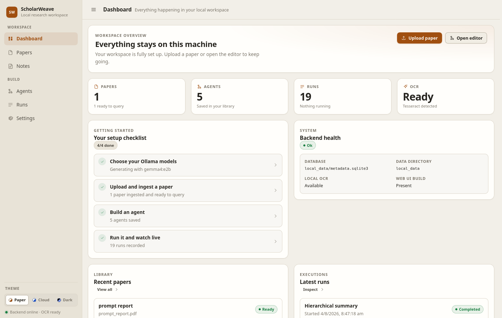
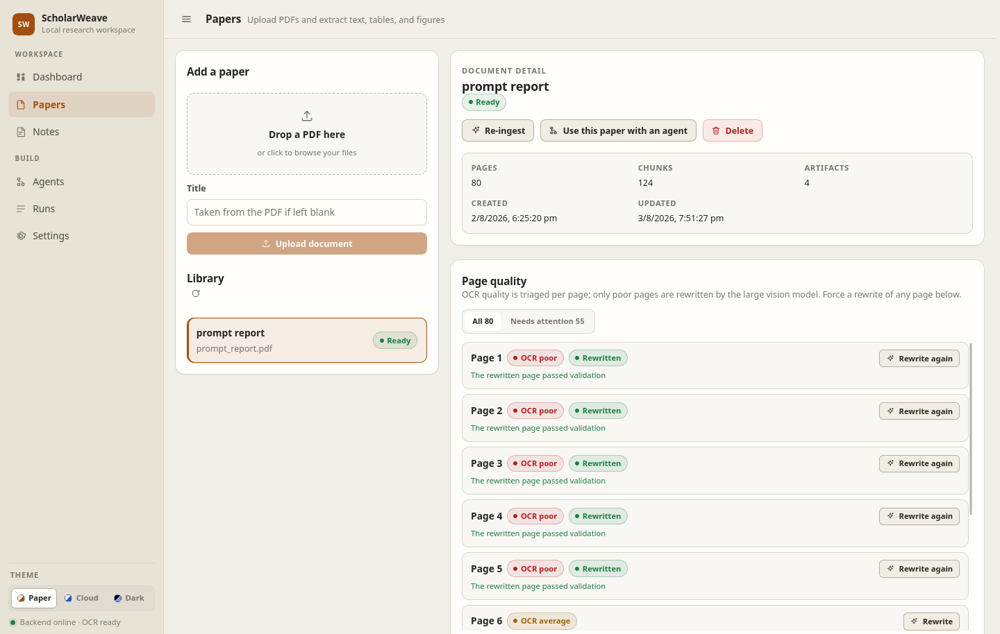
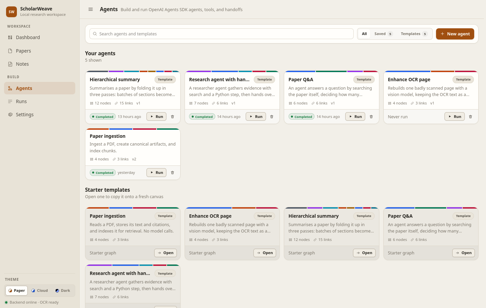
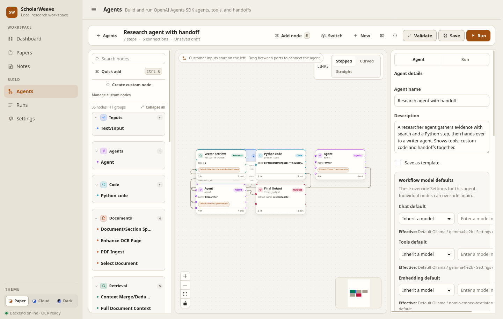
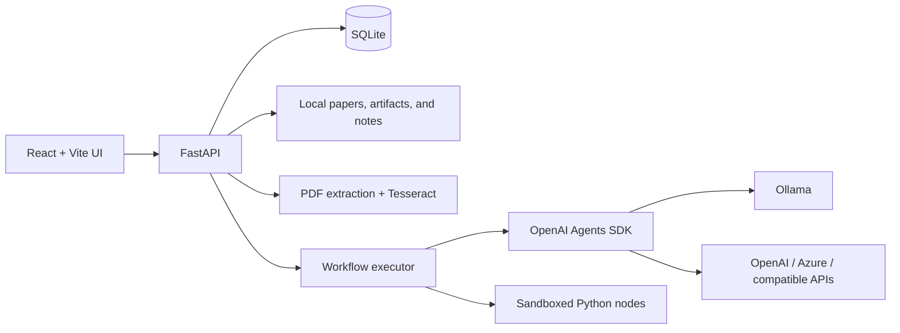

# ScholarWeave

**A local-first workspace for turning research papers into visual, reusable AI workflows.**

ScholarWeave combines PDF ingestion, OCR, retrieval, OpenAI Agents SDK orchestration, and a
node-based editor in one self-hosted app. Use local Ollama models by default, connect a cloud
provider when needed, and keep papers, runs, vectors, notes, and intermediate artifacts on your
machine.



## What you can do

| Area | Capabilities |
| --- | --- |
| **Papers** | Upload PDFs, extract text and figures, OCR text-poor pages, index chunks, and inspect page-level quality. |
| **Agents** | Build graph-based agents, tools, handoffs, branches, reusable subworkflows, and structured outputs. |
| **Models** | Use Ollama, OpenAI, Azure OpenAI, Azure AI Foundry, or another OpenAI-compatible endpoint. |
| **Automation** | Add sandboxed Python transforms, revisioned custom nodes, map/reduce steps, conditions, and bounded repeats. |
| **Observability** | Watch tokens, tool calls, handoffs, node outputs, errors, OCR progress, and saved artifacts in real time. |
| **Notes** | Read and organize workflow-generated Markdown from a safe local workspace. |

## How ScholarWeave works

### 1. Add a paper

Drop in a PDF and ScholarWeave creates a local document record, extracts its text, stores figures,
splits the content into chunks, and prepares it for retrieval. Tesseract handles scanned pages.
Optional vision models can triage OCR quality and rewrite only the pages that need help.



### 2. Start from a template or a saved agent

Use the included paper ingestion, Q&A, hierarchical summary, OCR enhancement, and research-agent
templates, or create a graph from scratch. Saved agents can also be reused as nodes inside other
agents.



### 3. Connect agents, tools, and handoffs

Drag nodes onto the canvas and connect typed ports. A data node becomes an agent tool when its
`tool` output is wired to an agent. Connect one agent to another agent's `handoffs` port to delegate
work. Each node can inherit application defaults or select its own provider and model.



### 4. Run and inspect every step

The run inspector records each node, streamed output, tool call, handoff, warning, error, and final
artifact. Nested agents remain visible at full depth, and active runs can be cancelled.


## Architecture



- The production React build is served by FastAPI.
- Workflow metadata, runs, settings, and vectors are stored in SQLite.
- Uploaded documents, extracted content, figures, and generated artifacts stay in `local_data/`.
- Notes and workflow file nodes are restricted to `workspace/`.
- Provider API keys are stored locally, masked by the API, and never embedded in workflow exports.

## Quick start

### Prerequisites

- Python 3.12+
- Node.js 20+ for the initial UI build
- [Ollama](https://ollama.com/) for the default local setup, or credentials for another supported provider
- Tesseract OCR and the required language pack for scanned PDFs

On Ubuntu or Debian:

```bash
sudo apt install tesseract-ocr tesseract-ocr-eng
```

For a fully local setup, pull one chat model and one embedding model:

```bash
ollama pull llama3.1:8b
ollama pull nomic-embed-text
```

Agent graphs with connected tools require a model that supports tool calling.

### Install

```bash
git clone https://github.com/giridharmunagala/scholarweave.git
cd scholarweave

python3.12 -m venv .venv
.venv/bin/pip install -r requirements.txt

cd frontend
npm ci
npm run build
cd ..
```

### Run

```bash
.venv/bin/uvicorn backend.app:app --host 127.0.0.1 --port 8000
```

Open [http://127.0.0.1:8000](http://127.0.0.1:8000).

On first use:

1. Open **Settings -> Model providers** and verify an Ollama or cloud-provider profile.
2. Assign application defaults for chat, tool calling, embeddings, and vision as needed.
3. Upload and ingest a PDF under **Papers**.
4. Open **Agents**, choose a template, complete its generated input form, and run it.
5. Follow live progress and inspect outputs under **Runs**.

## Workflow model

- **Workflow Input** nodes declare typed inputs such as text, numbers, JSON, lists, or document IDs.
- **Workflow Output** and **Final Output** nodes publish named results.
- **Agent** nodes hold instructions, optional structured-output schemas, model overrides, and turn limits.
- **Run when** rules and **If / Else** nodes provide typed conditional execution without evaluating arbitrary expressions.
- **Map**, **Reduce**, and bounded repeat nodes support long-document and batch workflows.
- Any saved workflow can be nested as a single node. Recursive graphs are rejected and nesting depth is capped.
- The Python export action emits a standalone Agents SDK script without API keys.

### Long-document summaries

The included hierarchical-summary template folds a paper in stages instead of sending the full
document in one oversized prompt:

1. Summarize bounded batches of chunks.
2. Fold those notes into cluster summaries.
3. Produce the final briefing from the smaller set of summaries.

Prompt context, map fan-out, repeat count, concurrency, and nesting depth all have configurable
safety limits. Oversized prompts retain the beginning and end while recording a warning.

## OCR pipeline

Standard ingestion extracts embedded PDF text and falls back to Tesseract on text-poor pages.
With **LLM-enhanced OCR** enabled, ScholarWeave:

1. OCRs each page locally.
2. Uses a small vision model to rate the page as good, average, or poor.
3. Sends only poor pages to the configured enhancement model for Markdown reconstruction.
4. Re-rates rewritten pages and falls back to the original OCR text if validation still fails.

Individual pages can be rewritten later from the paper detail screen.

## Configuration and local data

Settings can be changed in the UI or through environment variables prefixed with
`SCHOLARWEAVE_`, for example:

```bash
SCHOLARWEAVE_OLLAMA_BASE_URL=http://127.0.0.1:11434
SCHOLARWEAVE_MAX_CONTEXT_CHARS=40000
```

| Path | Contents |
| --- | --- |
| `local_data/metadata.sqlite3` | Settings, provider profiles, workflows, runs, and vectors |
| `local_data/documents/` | Uploaded PDFs |
| `local_data/artifacts/` | Extracted content, figures, and run outputs |
| `workspace/` | Markdown notes and files available to workflow file nodes |

These paths, `.env`, virtual environments, dependencies, and frontend build output are excluded
from Git.

## Development

Run the API with reload:

```bash
.venv/bin/uvicorn backend.app:app --reload --port 8000
```

Run the Vite development server in another terminal:

```bash
cd frontend
npm run dev
```

The Vite server proxies `/api` to FastAPI.

Run the existing checks:

```bash
.venv/bin/pytest
cd frontend && npm test && npm run build
```

## Security note

Provider keys are stored in the local SQLite database, which is not encrypted. Protect
`local_data/metadata.sqlite3` with normal filesystem permissions and never commit or share it.

Python nodes run in a separate process with network access blocked, an import allowlist, a timeout,
and CPU and memory limits. This is protection against mistakes, not a hardened security boundary.
Disable Python nodes in **Settings -> Python node sandbox** if untrusted users can edit workflows.
