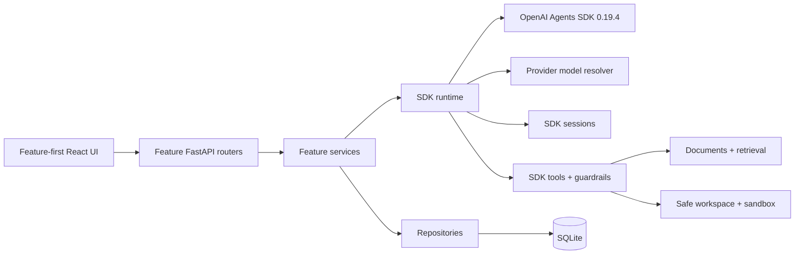

# ScholarWeave

**A local-first autonomous research agent built directly on the OpenAI Agents SDK.**

ScholarWeave combines PDF ingestion, OCR, retrieval, SDK-native agent composition, and a visual
authoring canvas in one self-hosted application. It supports local Ollama models, OpenAI, Azure
OpenAI, Azure AI Foundry, and OpenAI-compatible endpoints.

## Capabilities

| Area | Capabilities |
| --- | --- |
| **Papers** | Upload PDFs, extract text and figures, OCR text-poor pages, index chunks, and inspect page-level quality. |
| **Research agent** | Work with one autonomous chat agent that chooses tools, follows evidence, persists memory, and continues until the requested research outcome is complete. |
| **Tools** | Give the agent direct access to built-in research/workspace tools and revisioned sandboxed Python `FunctionTool` callbacks, with keyword discovery across the full available tool set. |
| **Runs** | Inspect SDK run items, tool calls, handoffs, guardrails, usage, interruptions, and streamed lifecycle events. |
| **Workspace** | Read and write safe local text artifacts without exposing arbitrary filesystem access. |

## Runtime model

ScholarWeave does not implement a separate graph executor. The canvas is a presentation layer over
an `AgentBlueprint`, which is compiled into real SDK objects:

- Each autonomous component is an SDK `Agent`.
- Capabilities are SDK `FunctionTool` or hosted-tool instances.
- Delegation uses `handoff()` or `Agent.as_tool()`.
- Validation uses SDK input, output, tool-input, and tool-output guardrails.
- Every execution uses SDK `Runner`.
- Pause and resume use serialized SDK `RunState`.
- Runtime observations are projections of SDK run items, hooks, and stream events.

Canvas coordinates are stored separately and never affect execution. There are no generic nodes,
ports, data-flow edges, conditions, or application-owned orchestration phases.

## Sessions and context

Model-visible conversation history is owned exclusively by the SDK `Session` contract:

- Conversations use one SQLite-backed SDK session each.
- Session history is retained without automatic replacement or summarization.

`ScholarWeaveContext` carries live repositories, IDs, services, and event sinks through
`RunContextWrapper`. Local context is not added to model input unless instructions or a tool
deliberately expose data.

## Architecture



The backend is organized by feature under `backend/agents`, `builder`, `conversations`,
`documents`, `providers`, `runs`, `tools`, and `workspace`. `backend/bootstrap.py` is the
composition root. The frontend mirrors those features under `frontend/src/features`; API types are
generated from FastAPI OpenAPI rather than maintained manually.

## Quick start

### Prerequisites

- Python 3.12+
- Node.js 20+
- [Ollama](https://ollama.com/) for a local setup, or credentials for another supported provider
- Docling (installed with the Python dependencies) or Tesseract with the required language pack

On Ubuntu or Debian:

```bash
sudo apt install tesseract-ocr tesseract-ocr-eng
```

For a local setup, pull chat/tool and embedding models:

```bash
ollama pull llama3.1:8b
ollama pull nomic-embed-text
```

The selected agent model must support tool calling when its blueprint binds tools.

### Install and run

```bash
git clone https://github.com/giridharmunagala/scholarweave.git
cd scholarweave

python3.12 -m venv .venv
.venv/bin/pip install -r requirements.txt

cd frontend
npm ci
npm run build
cd ..

.venv/bin/uvicorn backend.app:app --host 127.0.0.1 --port 8000
```

Open <http://127.0.0.1:8000>, configure provider defaults under **Settings**, ingest papers under
**Papers**, then use the fixed agents under **Research chat** or create an SDK blueprint under
**Agents** or through **Builder chat**.

## Providers

Provider profiles are resolved through the SDK model boundary:

- OpenAI profiles use `OpenAIResponsesModel`.
- Ollama and OpenAI-compatible profiles use `OpenAIChatCompletionsModel`.
- Azure OpenAI and Azure AI Foundry use their supported OpenAI clients.
- Provider capabilities are checked when a blueprint compiles; unsupported hosted tools or model
  features fail validation rather than degrading silently.

API keys are stored only in the local SQLite database, are masked by API responses, and are never
included in Python exports.

## OCR and retrieval

PDF ingestion uses Docling to preserve page layout, reading order, accurate table structure,
formulas, and code. RapidOCR is applied to scanned or text-poor regions, while an explicit OCR run
forces full-page recognition. Tesseract remains available as a lightweight alternative. Optional
vision models can rewrite poor pages after OCR. Documents are chunked for keyword and vector
retrieval; agents access that data through typed SDK tools instead of implicit prompt injection.

Each successful ingestion keeps one source PDF under `local_data/documents/<document-id>/source/`
and generates `extracted.md`, figures, and a versioned `manifest.json` under
`local_data/artifacts/documents/<document-id>/`. The manifest provides paper metadata, exact
page text and citations, a section outline, ordered chunks, figures, and content counts. An
ingestion with no readable text fails instead of creating a metadata-only ready document. The
research agent can inspect readiness, trigger embedded-text or OCR ingestion, read cited pages or
chunks, and search indexed text.

### Paper workspace notes

Durable paper notes use one canonical folder per stored paper:

```text
workspace/papers/<document-id>/
├── summary.md
└── notes.md
```

The autonomous agent resolves this folder before writing paper-specific notes. It can update an exact
Markdown selection or append content without regenerating the rest of a file. Workspace files also
support searchable tags; tag metadata is managed internally and shown above the file preview.

## Local data and cutover

| Path | Contents |
| --- | --- |
| `local_data/metadata.sqlite3` | Settings, provider profiles, SDK blueprints, custom tools, conversations, runs, documents, and vectors |
| `local_data/documents/` | Uploaded PDFs |
| `local_data/artifacts/` | Extracted content, figures, and generated artifacts |
| `local_data/llm_calls.jsonl` | Credential-redacted model request audit log |
| `workspace/` | Safe text files available through workspace tools |

On the first SDK-schema startup, ScholarWeave creates a timestamped
`metadata.pre-sdk-*.sqlite3` backup, removes incompatible runtime records, and preserves providers,
documents, chunks, and artifacts. Old graph definitions, node runs, builder plans, and Markdown
memory are intentionally not migrated.

Settings can also be provided through `SCHOLARWEAVE_` environment variables, for example:

```bash
SCHOLARWEAVE_OLLAMA_BASE_URL=http://127.0.0.1:11434
```

## Development

```bash
# API with reload
.venv/bin/uvicorn backend.app:app --reload --port 8000

# Frontend development server
cd frontend && npm run dev

# Generate API contracts
cd frontend && npm run generate:api

# Verify committed contracts have no backend drift
cd frontend && npm run check:api

# Checks
pytest
cd frontend && npm test && npm run build
```

`openai-agents==0.19.4` and `openapi-typescript==7.13.0` are exact pins. SDK upgrades are explicit
compatibility work and should update contract tests and generated API types together.

## Security

Protect `local_data/metadata.sqlite3` with normal filesystem permissions; it is not encrypted.
Sandboxed Python tools run in an isolated subprocess with network blocking, an import allowlist,
timeout, and CPU/memory limits. This protects against mistakes but is not a hardened security
boundary, so disable Python tools when untrusted users can author tool code.
