# ScholarWeave Architecture

ScholarWeave is a local-first conversational assistant for one researcher on one local machine. One
FastAPI process serves the API and built React application, runs a native agent harness, and stores
state in SQLite plus guarded local files.

> This document is the canonical architecture reference. See [recipes.md](./recipes.md) for change
> procedures.

## 1. System context

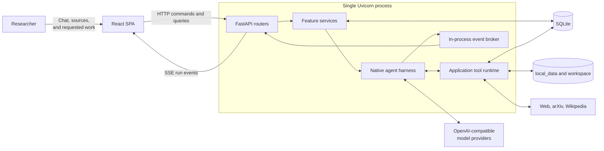

### Deployment boundary

- One researcher owns the whole library. There are no accounts, teams, sharing, permissions, or
  collaborative editing.
- One process and one Uvicorn worker.
- Bind to `127.0.0.1`; the application has no authentication.
- SQLite stores metadata and durable run history.
- `local_data/` stores generated extraction artifacts and operational run snapshots.
- `workspace/` stores source PDFs beside canonical paper notes/summaries, and reusable knowledge notes.
- Model traffic uses `POST /v1/chat/completions` through the official OpenAI client.

### Terminal client

`scholarweave_tui/` is an optional Textual presentation layer, installed with the `tui` extra and
launched with `scholarweave` or `python -m scholarweave_tui`. It connects to the loopback
HTTP API using `httpx` and the shared Pydantic wire models. The UI does not import application services,
construct a service container, access SQLite, or write research files. The single-worker backend
remains the only owner of inference, run lifecycle, persistence, and workspace indexing.

The launcher checks backend health and library identity before reusing a server. If absent, it
reserves an IPv4 loopback socket **before** spawning a separate backend process, passing the socket
through Python multiprocessing (including on Windows). Concurrent launchers cannot initialize a
second backend on that port. Readiness is bounded, startup logs are retained on failure, and closing
the launcher requests graceful shutdown of only its own child. The child also watches its parent
so an unexpectedly terminated TUI does not leave an owned backend behind. Pre-existing servers
are never stopped. `--connect-only` disables autostart.

`install-windows-launcher.ps1` at the repository root installs desktop/Start Menu shortcuts pointing to the small
`scripts/launch-scholarweave.ps1` wrapper in this checkout. It runs the same Python entry point with
`--build-frontend`; no custom executable or bundled runtime is built. Frontend build failures stop
startup and remain visible rather than opening a success-shaped TUI.

Chat commands use the existing conversation and run routes. The composer's `/` menu is presentation
only: `/model` saves `last_chat_model_reference` through `PUT /api/settings` and applies it when a
conversation is created, `/reasoning` sends a per-message `reasoning_effort` limited to the levels a
`ProviderModel` declares, and `/effort` and `/web` set existing per-message request fields. Focus
mode, the theme, the web toggle, and the per-model reasoning level live in
`local_data/tui-preferences.json`; no research behaviour is stored there. The terminal observatory
projects SSE events, resumes after the last received sequence, and reconciles the durable run after
stream closure. The run line above the composer shows the live phase, elapsed time, and a Stop button
that uses the existing run cancel route. Each turn retains a neutral stage ledger between the user
message and assistant response, with completed and active work plus elapsed time. The assistant's
muted usage line reports turn input, output, and cached tokens, cumulative conversation tokens, and
the latest main-model context size against its window when the run reports those values. Short turns
use a centered reading measure, while long answers expand across the available transcript width.
Normal startup shows the conversation rail,
keeps the optional observatory closed, and restores the most recently updated conversation; focus
mode remains an explicit remembered choice after the presentation-default migration. The composer
shows three lines by default, grows with wrapped or explicit lines to a bounded height, and then
scrolls internally so a long draft does not consume the transcript.
Leaving a screen does not cancel backend runs; quitting an owning launcher shuts its backend down.
Notes are read and saved through
the workspace API; a pre-save read catches already-visible external edits, but is not an atomic
concurrency guarantee. The paper reader displays existing extracted chunks and citations rather than
starting another extraction pipeline. Provider settings, paper acquisition, and PDF rendering remain
in the web client.

Presentation is theme-driven: `scholarweave_tui/themes.py` registers the shipped Textual themes and
`app.tcss` styles everything from theme variables, so no colour is hard-coded in widgets.
`scholarweave_tui/preferences.py` persists only the chosen theme in `local_data/tui-preferences.json`;
research behaviour stays in backend settings, and a read-only data directory degrades silently.

### Single-researcher product boundary

Every conversation, paper, folder, note, summary, and run implicitly belongs to the local
researcher. Domain records therefore do not carry user, tenant, membership, ownership, sharing, or
permission fields. Paper folders are personal organization labels, not shared containers.

Concurrency exists only to support the researcher's own work: a model may issue independent tool
calls, Deep Work may delegate a focused task, and background runs must survive interruption. Locks,
leases, and single-flight rules prevent the researcher's own tasks from colliding; they are not a
multi-user coordination layer. Do not add collaboration abstractions unless the product boundary
changes explicitly.

## 2. Process-scoped composition

All services are constructed **once per application process**, not once per request or chat.
`create_app()` stores the container on `app.state`; FastAPI dependencies retrieve that same
container for every request.

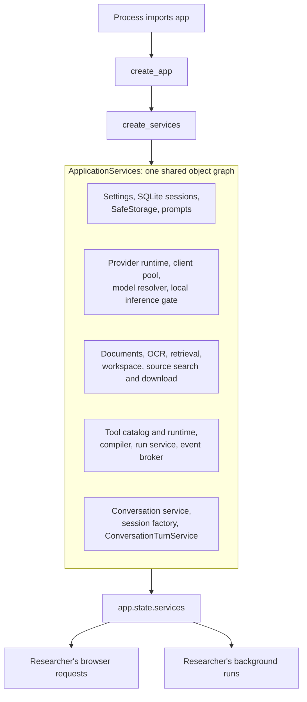

Shared process-scoped objects are intentional:

| Component | Why it is shared |
|---|---|
| `ProviderClientPool` | Reuses provider clients and closes them once |
| `InferenceScheduler` | Protects local model/GPU capacity during the researcher's own concurrent work |
| `ConversationSessionFactory` | Prevents overlapping turns in the same conversation |
| `RunService` | Tracks tasks, leases, cancellation, steering, and recovery |
| `EventBroker` | Fans live events out to SSE subscribers |
| `ApplicationToolRuntime` | Gives every run the same application capabilities |

Startup performs only process-level initialization: settings/database setup, stale-ingestion
recovery, workspace-folder checks, run cleanup scheduling, and interrupted-run recovery. It does
not load every document or create a new service graph for a chat.

## 3. Product surfaces and workflows

Each message selects an effort, not a permanent conversation workflow. The main model interprets
intent directly; there is no separate classifier call or keyword router.

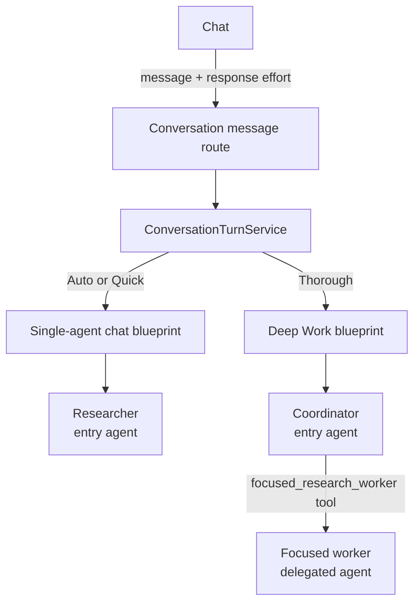

`ConversationTurnService` owns the application use case:

1. Validate the conversation.
2. Resolve per-message `response_effort` (`auto`, `quick`, or `thorough`).
3. Select the single-agent chat or Thorough blueprint independently of conversation kind.
4. Apply web access and explicit legacy response-style contracts.
5. Compile the blueprint.
6. Attach the paper-work completion policy.
7. Touch the conversation and create a run. Default titles are derived locally from the first
   message; new blueprints do not require a title tool/model round trip.

It does not execute model turns. `RunService` supervises execution, and `AgentRunner` owns the
model/tool loop.

Auto and Quick use one agent with local/web tools and optional work-plan tools. Narrow lookups and
discussion can finish without a plan; the model plans only substantial scoped assignments. Thorough
adds an optional focused worker and sequential execution, sharing the main instructions instead of
duplicating them. A plan's pending/in-progress items enforce continuation across epochs and recovery
at every effort, not only Deep Work. No plan is required merely to finish a conversation.

Auto/Quick stay on the interactive inference lane; Thorough and dedicated saved-summary runs use
background priority. The existing scheduler protects local capacity and cannot preempt an active
model response. Independent Auto/Quick tool reads can overlap; Thorough workers remain sequential.

Work plans accept stable model-chosen IDs and preserve them verbatim. Replaying the same plan
returns its current progress without resetting it; replacing a different plan is rejected with the
existing IDs. Items can return to pending or advance to in-progress/completed/blocked, with an
honest summary required for terminal states. Invalid updates are known input failures, not uncertain
write outcomes.

Response style is independent of this execution capability. The default `research` style follows
the requested outcome without requiring saved paper artifacts. `review` explicitly opts into a
reviewed summary and durable notes; `learn` and `understand` retain their narrower evidence checks.
The selected style is passed through Deep Work compilation and run metadata instead of being
coerced to review. Summarizing in chat is distinct from requesting a saved summary. General chat,
brainstorming, drafting, and explanation do not require paper acquisition or citations.

Compatibility: persisted `kind="deep_work"` does not lock future chat messages. The old Deep Work
message endpoint defaults to Thorough but accepts an explicit effort. Legacy `deep_work=True` is
per-message only; `fast_answer=True` retains its old bounded-web contract for older API callers.
Explicit `response_effort` overrides both flags. Legacy response-style fields remain API-only;
the UI uses Auto/Quick/Thorough and resets effort after sending or switching chats. Previously saved
run blueprints and completion policies remain available for recovery without a database migration.

## 4. Blueprint compilation

Blueprints are provider-neutral, serializable workflow definitions. The exact blueprint is stored
with every run so recovery can compile it again without serializing live Python state.

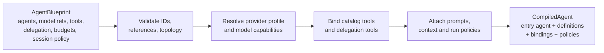

The compiler produces:

- an `AgentDefinition` for each agent;
- a concrete `ModelBinding` with a pooled client and provider capabilities;
- JSON-schema-backed `FunctionTool` objects;
- explicit delegation tools;
- run limits and context-compaction policy;
- an optional deterministic completion validator.

## 5. Run lifecycle

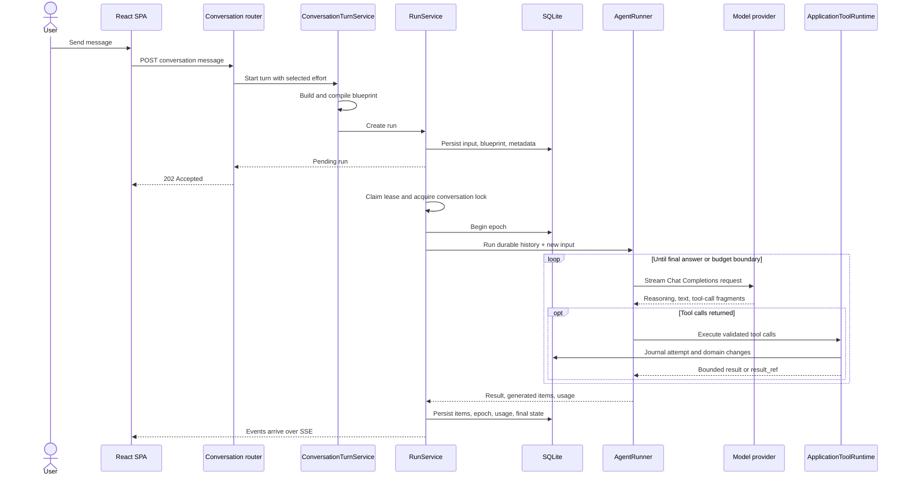

### Responsibility split

| Layer | Owns |
|---|---|
| Router | HTTP parsing and response shaping |
| `ConversationTurnService` | Selecting and launching one product workflow |
| `AgentCompiler` | Blueprint to executable agent definitions |
| `RunService` | Durable lifecycle, epochs, leases, recovery, cancellation, steering |
| `AgentRunner` | One bounded model/tool loop |
| `ApplicationToolRuntime` | Safe execution of ScholarWeave capabilities |

## 6. Native model/tool loop

The harness is a deterministic state machine around probabilistic model output.

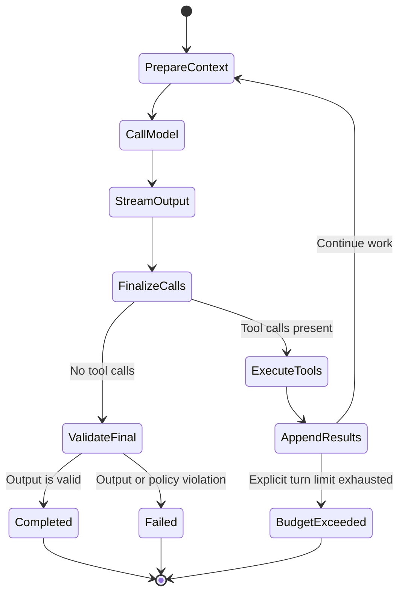

Canonical conversation items are plain provider-neutral dictionaries:

- user, assistant, system, and developer messages;
- function calls;
- function-call outputs;
- reasoning items.

They become Chat Completions messages only at the provider boundary. Streamed tool-call fragments
are reassembled by index, call ID, or last-seen call to tolerate OpenAI-compatible provider
differences.

The harness enforces:

- optional model-turn limits and input/output size limits;
- tool concurrency;
- per-turn single-flight tools;
- structured-output JSON Schema;
- maximum delegation depth;
- preservation of assistant text emitted alongside tool calls.

## 7. Tools and domain capabilities

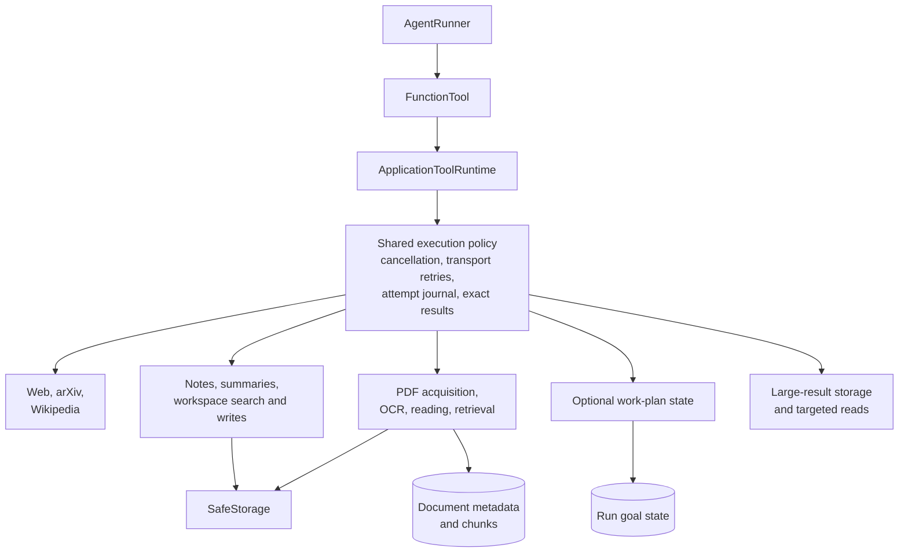

The tool catalog is the model-visible contract: catalog ID, tool name, description, JSON schema,
strictness, and runtime handler. The runtime centralizes operational behavior so individual tools
do not each reinvent it.

### Tool result forms

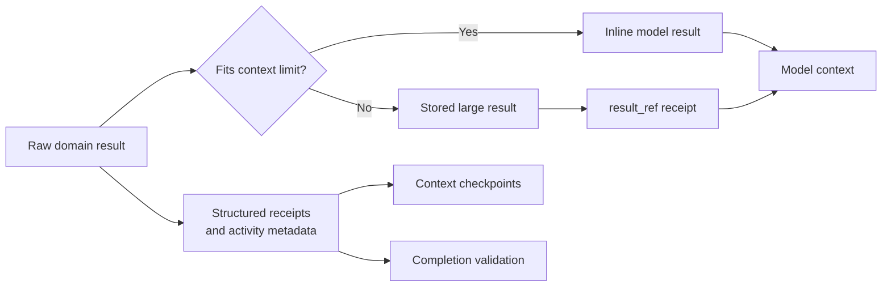

Safe reads may retry transient failures. Writes are not blindly retried; cancellation after dispatch
is journaled as an unknown outcome when success cannot be proven.

Tool failures have two representations. Operational records retain the original exception type and
message for diagnosis, while `tool.failed` events also carry a short, actionable
`display_message`. The activity UI renders only that readable message, so provider internals and
raw exception text are not presented as user guidance.

## 8. Delegated agents

Delegation is implemented as an explicit function tool, not an implicit handoff.

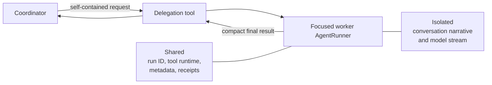

The worker cannot see the parent's transcript. Its token stream is buffered independently as
`agent.stream`, retaining invocation, parent invocation, and delegation tool-call IDs. The UI
nests worker reasoning, tools, and responses under that call, including nested helpers. Worker
assistant messages never become the parent's answer; durable snapshots preserve the trace on replay.
Delegation is currently a nested, synchronous tool call rather than an independently scheduled
child run.

Deep Work executes tools and delegated tracks sequentially in provider call order. The coordinator
creates the shared plan; workers can read it and update assigned items, but cannot create another
plan. Runtime enforcement also applies to recovered Deep Work blueprints that previously enabled
parallel calls. A serialized tool queues additional calls rather than rejecting or dropping them;
cancelled runs never start queued work. Ordinary research can still parallelize independent tools.

## 9. Events and frontend reconstruction

Events are the execution-to-UI contract, not merely logs.

Chat prioritizes the answer and editable composer. Observe opens the full hierarchical trace directly;
usage and the optional work plan are compact, collapsed disclosures instead of a second worker dashboard.
Running workers expand to show their current activity; assignments and handoffs remain expandable.
The compact activity line is docked above the composer, outside transcript scrolling. It shows
current-phase and total elapsed time, plus recent trace headlines. Active tools never join a
collapsed group of completed calls. Repeated provider tool-call IDs create distinct steps across
model iterations. Event reducers deduplicate replay across subscription restarts; after a stream
error or ten seconds without events, a run snapshot repairs missing activity without discarding
already-received live deltas.
Focus hides the chat list and closes the panel while
retaining access to observability. Live reasoning and per-turn performance use collapsed disclosures.
Per-message effort replaces the overlapping research styles, permanent Deep Work toggle, and
fast-web shortcut. Web access and model context/reasoning controls remain available. Library
handoffs carry only a draft prompt identifying a paper or workspace path in `/?research=...`;
opening one starts no run and does not reopen an unrelated conversation. The shared Markdown
viewer memoizes unchanged content to avoid reparsing historical answers on each stream update.

Chat uploads use `POST /agent/attachments` before a message is sent. `ConversationAttachmentService`
validates bounded UTF-8 Markdown/text or PDF input, stores text through `WorkspaceService`, and reuses
the existing document ingestion/OCR pipeline for PDFs. Text uploads live under
`inbox/attachments/<content-key>/<filename>`; PDF originals remain in their canonical paper folders,
with derived text under `attachments/` for workspace discovery. Each write updates FTS immediately; no
whole-workspace refresh or model call is needed. Identical PDF bytes reuse the existing library
document; text re-uploads do not overwrite external edits. Failed PDF preparation is surfaced to the
user, retaining the source for retry rather than presenting an unreadable attachment as ready.

Message requests carry bounded `attachment_paths`. The turn service validates these paths through
safe storage, then persists readable file references and PDF document IDs with the user input, so
follow-ups and recovered runs retain the same context without a separate attachment database.
The model reads those paths using existing note/paper tools, interprets requested tasks within
supported chat/research capabilities, asks about material ambiguity, and declines unsupported execution
requests. File contents never override the user's scope or higher-priority instructions. Draft
attachment removal only detaches the file; deleting a chat does not delete durable research files.

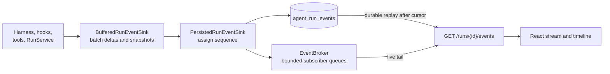

Every event has a monotonically increasing sequence number. The browser de-duplicates by sequence.
On connection, the API subscribes to the broker, replays durable events, catches up from broker
history, and then tails live events. A lagging subscriber disconnects and can resume from its last
durable cursor.

The same event list reconstructs:

- streamed answer text and reasoning;
- tool calls, results, failures, and durations;
- delegated-agent lifecycle and isolated worker reasoning/response streams;
- context compaction;
- usage and run terminal state.

`model.phase` reports queue waiting, waiting for the provider, thinking, tool-argument preparation,
and answer generation. A request-local callback connects the shared inference lane to the owning
agent's events without adding provider request fields. Processing-context status is shown only
when the provider supplies valid prompt-progress data; silence alone is not evidence of prefill.

Each model attempt emits `model.telemetry` with a unique call ID. Overall usage includes main,
delegated, dedicated-summary, retry, and compaction calls; replay and forwarded child events
are deduplicated by call ID. Missing provider usage is marked incomplete rather than estimated
from output characters. Main-agent context is tracked separately: estimated request input before
generation, then provider-reported input plus output for the latest successful main-agent call.
Delegate and compaction measurements cannot replace that context indicator.

Prompt-cache reuse is optional: native usage `prompt_tokens_details.cached_tokens` (or
`input_tokens_details.cached_tokens`) and llama.cpp `timings.cache_n` feed per-call telemetry.
Cumulative cache totals deduplicate call IDs and report coverage separately, so missing reports
never become zero-hit measurements. The usage disclosure hides cache information when unavailable.
No cache/progress extension parameters are sent to generic OpenAI-compatible APIs.
Static compiled instructions retain the user profile but not a freshly generated clock.
Each new run persists one timezone-aware request-time context alongside its appended input.
Delegates receive that same clock context without the parent transcript; tool rounds and recovery
reuse it rather than regenerating time before the history. Existing compiled runs retain their
original instructions. Stable prefixes enable server-side reuse but cannot guarantee cache hits.

Prefill and generation speeds use llama.cpp response `timings` (`prompt_n`/`prompt_ms` and
`predicted_n`/`predicted_ms`), including timing-only terminal stream chunks. Each average is total
timed tokens divided by total server phase time, excluding queueing, tools, idle gaps, and network
latency. Missing timings display as unavailable; old wall-clock estimates are not relabeled as
server measurements. Visible speed readings update at most once every five seconds per run.
Session rates sum timed tokens and active durations across runs rather than averaging run rates.
Timed-call counters expose coverage; absent counters in older history are unknown, not zero.
Agent lifecycle and model/tool events carry invocation IDs so concurrent workers with the same name
remain distinct. Agent starts include a bounded assignment preview with an explicit truncation flag.
The frontend identifies the coordinator from lifecycle events, not the blueprint's display name.

Conversation-linked runs are excluded from automatic expiry because their events are the durable
session-usage ledger. Explicit history clearing, run deletion, and conversation deletion still
remove those records. Measurements from previously deleted history cannot be reconstructed.

## 10. Durability, epochs, and recovery

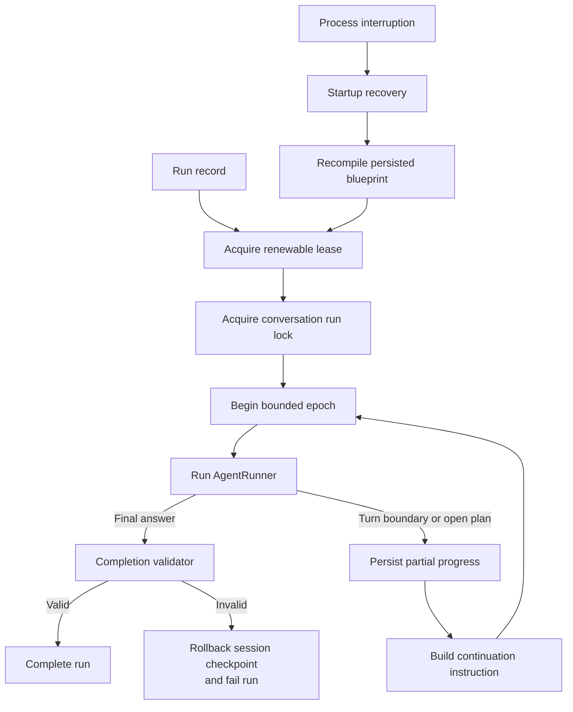

Durable run state is intentionally redundant:

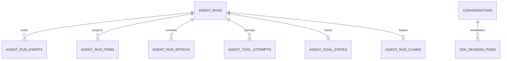

- **Run row:** status, input, blueprint, output, usage, runtime metadata.
- **Events:** durable chronological UI and diagnostic stream.
- **Items:** transcript-oriented projections.
- **Epochs:** bounded execution segments and continuation points.
- **Tool attempts:** retries, failures, result references, and uncertain writes.
- **Goal state:** optional work plan at any effort.
- **Claim:** current execution task and lease expiry for interruption recovery, not user ownership.
- **Session items:** canonical cross-turn conversation history.

Recovery starts a new epoch from durable facts. It does not attempt to deserialize a suspended
coroutine or resume a partially received model stream.

## 11. Context management

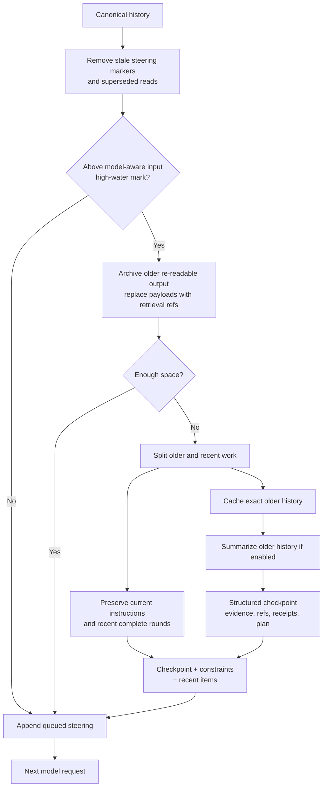

Compaction occurs only between complete model/tool rounds. The compacted list becomes the runner's
new working context, while generated items remain available for durable history. A separate durable
session working snapshot and cursor allow subsequent turns to read the snapshot plus new items
instead of recompacting the original transcript. Snapshot recovery and rollback preserve
conversation ordering and steering.
Legacy lossy working snapshots are rebuilt from canonical session history on their next read;
versioned cache-backed snapshots then take over without deleting the original transcript.

The chat's selected context window, minus response capacity, determines the input ceiling.
An explicit chat selection takes precedence over provider metadata in either direction: a 30,000-token
chat stays within that budget even for a 128K model, and a 256K selection is not clamped to a provider
entry advertising 128K. Provider metadata and the application default only seed an unspecified window.
The effective size is persisted with the run and returned in run responses; reopening a conversation
restores its latest run's size instead of resetting the chat selector to the provider default.
Legacy manual working-input, tool-output, and compaction-target settings no longer constrain
execution. Context preparation derives a proportional retention target instead of collapsing an
80k-token window to an 8k-token checkpoint.
Request accounting includes instructions and tool schemas and reports estimates through
`context.prepared` (the UI also accepts older `context.sized` events). Provider-reported prompt usage
calibrates subsequent per-agent estimates; these remain estimates, not exact provider tokenization.
Unfit irreducible instructions fail explicitly rather than being silently truncated. Fresh tool
outputs are not clipped to a fixed token allowance. Context preparation archives oversized evidence
when necessary; durable paper evidence makes superseded raw reads evictable.
Pending summary batches are resized to actual request space with matching source spans and
checkpoint cursors. Archived-only raw source cannot be claimed as complete read coverage.

Older cached tool payloads are evicted before narrative compression, preserving recent complete
model/tool rounds. Exact context history is retained behind paginated `read_tool_result` references;
conversation-scoped caches survive run-history cleanup and are deleted with their conversation.
Chat deletion first cancels and waits for its runs, then removes their database history, run-scoped
artifacts, operational snapshots (including snapshots retained after run cleanup), and conversation
caches. Saved library papers, notes, summaries, and workspace files remain independent research
outputs and are not deleted with a chat.
The shared provider traffic audit log is not conversation-scoped and is not erased by chat deletion.
Model-assisted summarization is a last resort for the older prefix. The deterministic-only setting
avoids its model call but retains excerpts rather than a semantic summary. Neither writing a cache
file nor provider KV caching reduces active context unless the request itself replaces or omits
the original text.
Soft-threshold compaction runs only when protected context fits below the high-water mark and
reclaimable history is at least 5% of the input budget (or 256 tokens for small windows). This avoids
repeated low-value compaction when fixed instructions and recent rounds dominate the request.
Hard-limit pressure still forces safe paging/compaction or an explicit budget error.
An optional `default_model_references.compaction` selects a helper through the normal provider
resolver. Its compaction request budget follows the active chat/agent context window, not the helper's
provider-level context metadata. Helper reasoning settings remain independent. The selected size is an
application budget, not a way to enlarge the model server's actual capacity. A provider rejection,
history exceeding the selected budget, or an unusable helper response emits a compaction failure/fallback event and
retries the main model before using the existing explicit deterministic fallback. Provider model
switches use the shared inference scheduler.

Default chat, Deep Work, paper summaries, and delegated research have no total turn cap. The harness
represents unbounded work with `max_turns=None`, not a large sentinel. Epoch checkpoints remain bounded for
durability, without limiting the number of epochs. There is no total run wall-clock deadline.
Cancellation, network timeouts for stalled I/O, leases, and completion gates still apply.
There is no whole-tool wall-clock deadline around loading, prefill, execution, or queued mutations.
Explicit custom blueprint turn limits remain opt-in; stop-and-answer requests one response.

For automatic response allowances, `finish_reason=length` recomputes only the uncommitted model
turn with a doubled allowance, bounded by remaining context rather than a fixed output ceiling.
That larger allowance is local to the retried turn; later turns return to the configured default
instead of needlessly reserving the largest earlier output budget and forcing compaction.
Every attempt contributes to usage. No partial tool calls enter execution or durable conversation
history. `model.retry` retracts partial assistant text in both live and persisted stream projections;
completed tool operations and prior assistant messages remain intact. Cancellation interrupts
recomputation normally. Explicit blueprint response caps are not silently overridden.
Recognized provider context-overflow rejections tighten calibration and rerun context preparation.
An identical rejected request is never resent; unrelated provider errors still surface explicitly.

## 12. Research data pipeline

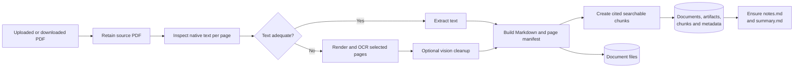

PDF opening, lazy page-tree parsing, native page extraction, and Tesseract availability probes in
the asynchronous OCR paths are offloaded through AnyIO's existing worker pool. Pages are still
processed sequentially and callbacks remain on the event loop. This removes document-length event
loop stalls without multiplying page-image memory, model concurrency, or application workers.

The principal document entities are:

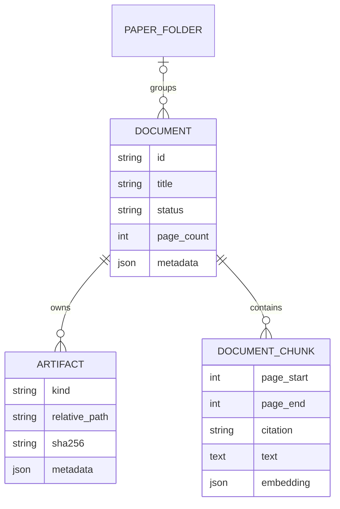

Folder assignment changes document metadata only; it does not move source PDFs or workspace files.
All user-controlled paths pass through `SafeStorage` or `WorkspaceService`.

`WorkspaceLayout` owns readable, bounded path components. `workspace_papers` stores each paper's
stable folder and display name separately from the derived search index. Papers live under
`library/papers/<title--id>/` with `source.pdf`, `notes.md`, `summary.md`, `summaries/` and `evidence/`.
New standalone notes live under `knowledge/<title--id>.md`. All paths are relative to the workspace
root; artifact resolution explicitly supports the workspace storage area and validates containment.
Ingestion resolves source artifacts through the repository instead of assuming a legacy PDF root.

The offline layout upgrade snapshots files and SQLite, verifies copies, updates metadata/index paths
transactionally, and then removes relocated originals. Its journal permits resuming an interrupted
upgrade. It retires old conversation/run rows without deleting research records. Server startup
refuses mixed layouts. Legacy JSON metadata is imported by this explicit upgrade, not by normal reads.
See [workspace-upgrade.md](workspace-upgrade.md) for restore behavior and operational requirements.

### Workspace discovery

| API (all under `/api`) | Purpose |
| --- | --- |
| `GET /documents` | Local paper library, including PDFs not yet prepared |
| `GET /workspace/notes` | Standalone Markdown notes and canonical paper notes |
| `GET /workspace/summaries` | Canonical summary files, including not-yet-filled templates |
| `GET /workspace/files` | Existing complete safe-file listing |
| `GET /workspace/search` | BM25-ranked text search or filtered browsing |
| `GET /workspace/index` | Index engine and indexed-file count, without a disk scan |
| `POST /workspace/index` | Reconcile external changes and atomically rebuild the index |

Notes, summaries and search accept `limit` (1-100, default 50) and zero-based `offset`. Search accepts
`query`, repeated `kinds`, and repeated `tags` (all supplied tags must match, case-insensitively).
Omit the query to browse. Query words are OR-matched and safely quoted, not interpreted as FTS
operators; punctuation-only queries return no matches. Results contain compact excerpts and positive
BM25 scores (higher is better), ordered by relevance, then modification time and path. Display titles
are weighted above content. This is lexical whole-token search, not embeddings or PDF source search.

The existing SQLite FTS5 table is the durable inverted index; no duplicate JSON index is needed.
Markdown, plain text, and JSON content plus file names, display titles, and tags are indexed.
Application writes/deletes update it in the same repository transaction as metadata. Refresh reads
safe files first, preserves existing names/IDs/tags, removes deleted paths, and replaces both tables
in one transaction. A process-local lock serializes refresh with workspace mutations; read failures
leave the previous index untouched. External editors are not watched: refresh explicitly after their
changes. Search/list calls query SQLite rather than reopening or scanning the workspace.

Agents share these services through `list_workspace` (bounded pages and `next_offset`),
`search_research_notes` (BM25 with pagination), and `workspace_index` (status/refresh). Canonical
summaries can be incomplete or stale: agents read selected artifacts and verify source citations.
Immutable summary history remains at `/documents/{id}/summaries`, separate from canonical discovery.

`organize_workspace` exposes single-file move/rename, tag replacement, and user-authorized deletion
to research agents. It accepts exact indexed standalone text paths, refuses overwrites, traversal,
folders, managed paper artifacts, attachments, and internal metadata, and preserves note IDs/tags
on moves. Moves and deletions update the existing FTS index immediately; failed move indexing rolls
the file back. Cleanup authorization is scoped by the conversation, not inferred from organization.

Paper content search uses SQLite FTS5 with transactional chunk-index triggers, not an embedding or
model call. Chunk reads use database `LIMIT`/`OFFSET`; page/chunk tool responses honor explicit
item/character continuation cursors without a hidden global output cap.

Summary jobs use one serial model worker. Short extractions fitting the context allowance are
included directly; longer papers use adaptive read/checkpoint batches with no fixed page cap.
Dedicated summaries reserve 10% of the configured effective model window for safety and 25% for
the initial response allowance; the remaining 65% covers input, including instructions and tool
schemas. An 80,000-token window therefore allows 52,000 input tokens, 20,000 output tokens, and
8,000 safety tokens. This allocation is summary-specific; general research retains its existing
context policy. Source admission measures the serialized request rather than imposing a fixed
character cap. Papers that do not fit continue through exact durable evidence cursors.
Reasoning defaults to off for both reviewed summaries and overviews when the model declares support
for disabling it. Explicit summary reasoning selections take precedence; unsupported selections
are rejected. Models without a supported off setting retain provider behavior.
Research agents use the dedicated summary tool to invoke an isolated persistent summary run instead
of drafting the summary in the general research transcript. Agent-requested summary jobs are
serialized over their entire lifetime. Their telemetry is forwarded to the parent without exposing
their transcript or replacing its main-agent context measurements.
Durable per-paper job receipts let recovered callers reattach to the same child run and replay
unforwarded telemetry instead of creating duplicate summaries.
The `paper_evidence` table retains source/extraction-versioned evidence independently of runs, with
a guarded `library/papers/<title--id>/evidence/<source-version>/index.json` workspace mirror. SQLite commits precede
mirror verification and raw-context eviction; interrupted mirrors are repaired from SQLite.
Records retain exact spans and model/prompt provenance. Only contiguous full coverage is marked
complete; otherwise saved summaries explicitly report partial coverage. Immutable summary versions
are replay-safe, and a late job does not replace a canonical summary changed since that job started.
Evidence never overwrites user notes; source changes invalidate generated summary/evidence reuse.
The summary-save tool is terminal only after successful execution; reads, checkpoints, and failed
saves do not end the job. The run completion validator verifies the immutable content hash and
source identity before declaring success. No closing model call or duplicate save is needed.
Recovery can reconstruct lost activity from a verified immutable receipt and reuse a saved version
even when an older child run failed after saving, without generating a duplicate artifact.

## 13. Deterministic safety and completion controls

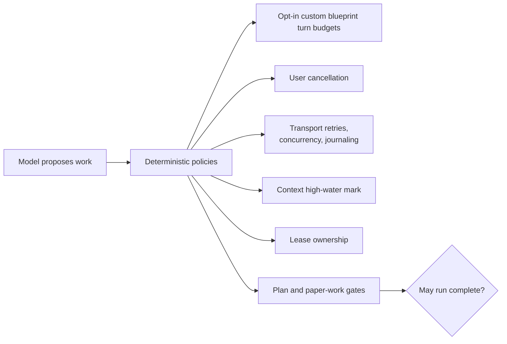

A model saying “done” is not sufficient when a completion policy applies. Review mode requires
read/extraction, a complete cited summary, and durable notes. The default Research mode permits
discussion of saved work and screening acquired candidates without forcing those artifacts.
Learn/Understand modes require targeted source reads without full-review side effects. Citation
fidelity is instructed rather than checked by answer-format matching.
Every effort must close or block its current run's tracked work items. Artifact intent outside explicit review
is model-guided, not a keyword classifier or a hard write-permission gate.

Tool retry policy is action-aware: paper preparation and summary coverage advancement are writes,
even when exposed under a read tool. Pure reads use bounded retry deadlines with Retry-After and
jitter. Unknown write outcomes are reconciled, not blindly retried. Source-specific repeated
failures pause that source rather than disabling access to unrelated papers or URLs.

All model requests share one application-wide inference lane, even for the same model or different
provider profiles. The transport holds it until the response is consumed or closed, not across tool
execution or delegation, so child requests and compaction do not deadlock behind a coordinator.
Interactive requests take priority between responses; a waiting background request is admitted
after three interactive calls to prevent starvation. Queued cancellation does not interrupt an active
response. The legacy `serialize_model_switches` field remains accepted for stored-profile/API
compatibility, but cannot bypass the global lane and is no longer exposed as a concurrency toggle.
The server owns model loading and hot swaps; `/v1/models` may list any number of models.
There is no manual load confirmation or restart pause. Old residency configuration is ignored,
and provider updates remove it without a database cutover or deletion of research history.

## 14. Extension map

| Change | Primary extension point |
|---|---|
| Add an HTTP endpoint | Feature router, schema, service, generated OpenAPI client |
| Add a model-callable tool | Tool catalog, runtime handler, model-visible prompt guidance |
| Change Research or Deep Work composition | Blueprint builders in `conversations/turns.py` |
| Add a provider kind | Provider schemas/runtime/model resolver |
| Change model-loop behavior | Native harness |
| Change run durability or recovery | Run service, repository, and run models |
| Add an event type | Backend producer and frontend `RUN_EVENT_TYPES` |
| Change context compaction | Context budget policy |
| Change paper ingestion | Document ingestion/OCR/vision pipeline |
| Add a user-visible research artifact | Domain service plus `SafeStorage` or `WorkspaceService` |

## 15. Architectural invariants

1. Routers call services; only repositories open ORM sessions.
2. All research data implicitly belongs to one local researcher; do not add collaboration or
   tenancy layers.
3. The application uses one process-scoped service graph.
4. The native harness owns the model/tool loop; domain behavior stays behind tools.
5. Canonical conversation items remain provider-neutral.
6. Persist events before publishing them.
7. Treat SQLite and guarded files as the durable recovery boundary.
8. Never write user-facing paths outside `SafeStorage` or `WorkspaceService`.
9. Do not run multiple Uvicorn workers without replacing the in-memory control plane.
10. Keep event names synchronized with the frontend subscriber.
11. Let deterministic completion policies—not model confidence—decide whether constrained work is
    complete.
