# ScholarWeave Architecture

ScholarWeave is a local-first research workspace for one researcher on one local machine. One
FastAPI process serves the API and built React application, runs a native agent harness, and stores
state in SQLite plus guarded local files.

> This document is the canonical architecture reference. See [recipes.md](./recipes.md) for change
> procedures.

## 1. System context

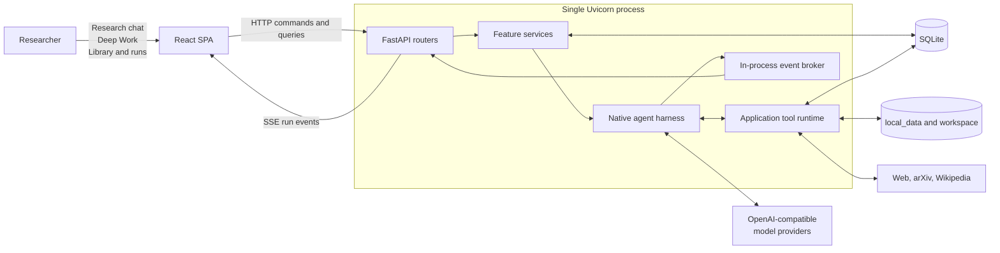

### Deployment boundary

- One researcher owns the whole library. There are no accounts, teams, sharing, permissions, or
  collaborative editing.
- One process and one Uvicorn worker.
- Bind to `127.0.0.1`; the application has no authentication.
- SQLite stores metadata and durable run history.
- `local_data/` stores source documents, generated artifacts, and operational run snapshots.
- `workspace/` stores user-visible Markdown research files.
- Model traffic uses `POST /v1/chat/completions` through the official OpenAI client.

### Single-researcher product boundary

Every conversation, paper, folder, note, summary, and run implicitly belongs to the local
researcher. Domain records therefore do not carry user, tenant, membership, ownership, sharing, or
permission fields. Paper folders are personal organization labels, not shared containers.

Concurrency exists only to support the researcher's own work: a model may issue independent tool
calls, Deep Work may delegate a focused task, and background runs must survive interruption. Locks,
leases, and single-flight rules prevent the researcher's own tasks from colliding; they are not a
multi-user coordination layer. Do not add collaboration abstractions unless the product boundary
changes explicitly.

## 2. Process-scoped composition

All services are constructed **once per application process**, not once per request or chat.
`create_app()` stores the container on `app.state`; FastAPI dependencies retrieve that same
container for every request.

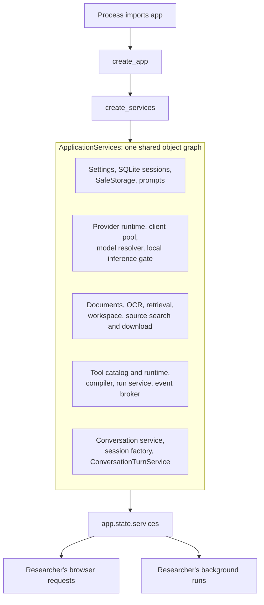

Shared process-scoped objects are intentional:

| Component | Why it is shared |
|---|---|
| `ProviderClientPool` | Reuses provider clients and closes them once |
| `InferenceScheduler` | Protects local model/GPU capacity during the researcher's own concurrent work |
| `ConversationSessionFactory` | Prevents overlapping turns in the same conversation |
| `RunService` | Tracks tasks, leases, cancellation, steering, and recovery |
| `EventBroker` | Fans live events out to SSE subscribers |
| `ApplicationToolRuntime` | Gives every run the same application capabilities |

Startup performs only process-level initialization: settings/database setup, stale-ingestion
recovery, workspace-folder checks, run cleanup scheduling, and interrupted-run recovery. It does
not load every document or create a new service graph for a chat.

## 3. Product surfaces and workflows

The HTTP surface selects a product workflow; it does not dynamically route among arbitrary agents.

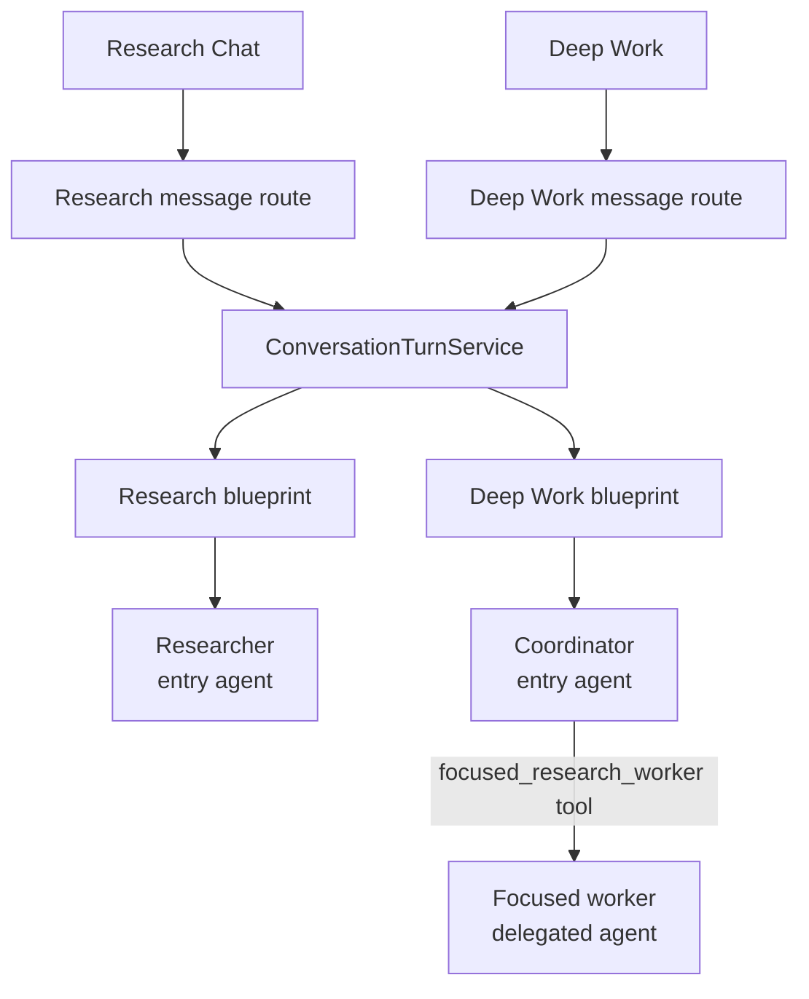

`ConversationTurnService` owns the application use case:

1. Validate the conversation kind.
2. Detect the first turn.
3. Build the Research or Deep Work blueprint.
4. Apply feature flags such as web access and fast-answer mode.
5. Compile the blueprint.
6. Attach the paper-work completion policy.
7. Touch the conversation and create a run.

It does not execute model turns. `RunService` supervises execution, and `AgentRunner` owns the
model/tool loop.

## 4. Blueprint compilation

Blueprints are provider-neutral, serializable workflow definitions. The exact blueprint is stored
with every run so recovery can compile it again without serializing live Python state.

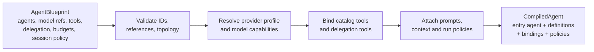

The compiler produces:

- an `AgentDefinition` for each agent;
- a concrete `ModelBinding` with a pooled client and provider capabilities;
- JSON-schema-backed `FunctionTool` objects;
- explicit delegation tools;
- run limits and context-compaction policy;
- an optional deterministic completion validator.

## 5. Run lifecycle

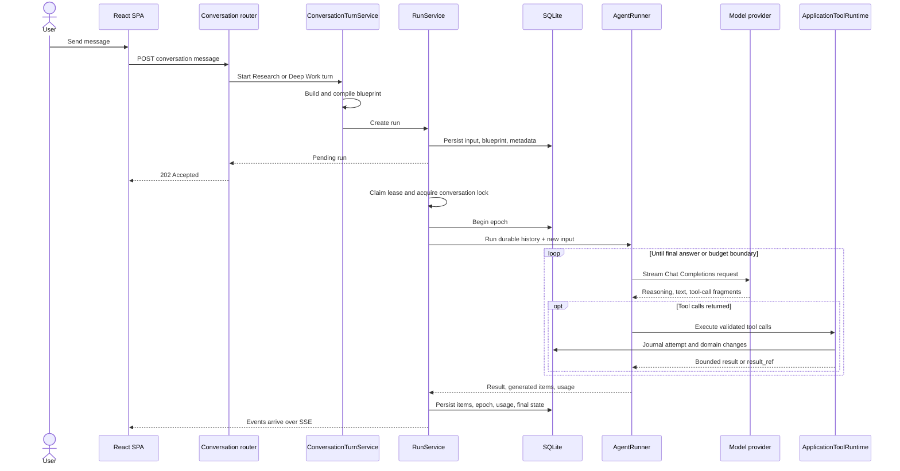

### Responsibility split

| Layer | Owns |
|---|---|
| Router | HTTP parsing and response shaping |
| `ConversationTurnService` | Selecting and launching one product workflow |
| `AgentCompiler` | Blueprint to executable agent definitions |
| `RunService` | Durable lifecycle, epochs, leases, recovery, cancellation, steering |
| `AgentRunner` | One bounded model/tool loop |
| `ApplicationToolRuntime` | Safe execution of ScholarWeave capabilities |

## 6. Native model/tool loop

The harness is a deterministic state machine around probabilistic model output.

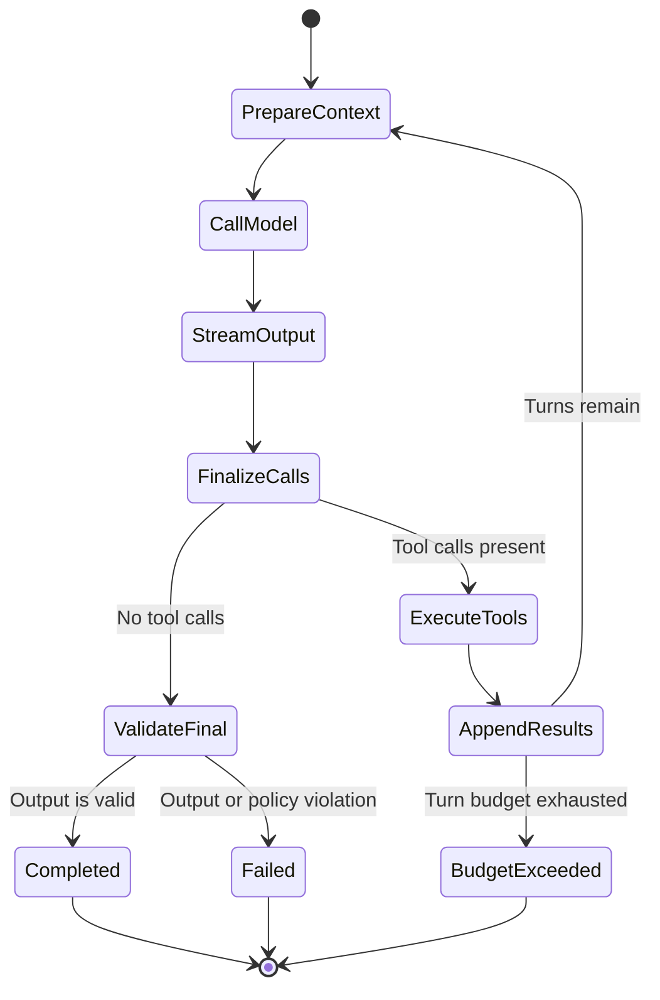

Canonical conversation items are plain provider-neutral dictionaries:

- user, assistant, system, and developer messages;
- function calls;
- function-call outputs;
- reasoning items.

They become Chat Completions messages only at the provider boundary. Streamed tool-call fragments
are reassembled by index, call ID, or last-seen call to tolerate OpenAI-compatible provider
differences.

The harness enforces:

- model-turn and input/output size limits;
- tool concurrency;
- per-turn single-flight tools;
- structured-output JSON Schema;
- maximum delegation depth;
- preservation of assistant text emitted alongside tool calls.

## 7. Tools and domain capabilities

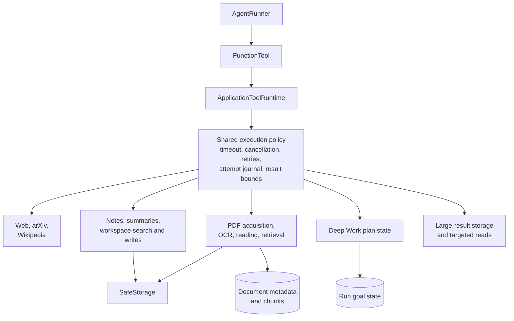

The tool catalog is the model-visible contract: catalog ID, tool name, description, JSON schema,
strictness, and runtime handler. The runtime centralizes operational behavior so individual tools
do not each reinvent it.

### Tool result forms

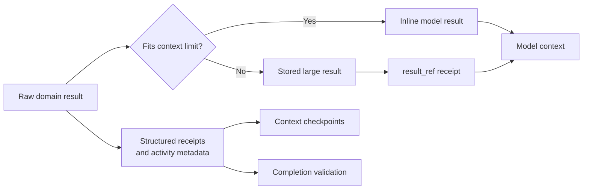

Safe reads may retry transient failures. Writes are not blindly retried; cancellation after dispatch
is journaled as an unknown outcome when success cannot be proven.

Tool failures have two representations. Operational records retain the original exception type and
message for diagnosis, while `tool.failed` events also carry a short, actionable
`display_message`. The activity UI renders only that readable message, so provider internals and
raw exception text are not presented as user guidance.

## 8. Delegated agents

Delegation is implemented as an explicit function tool, not an implicit handoff.

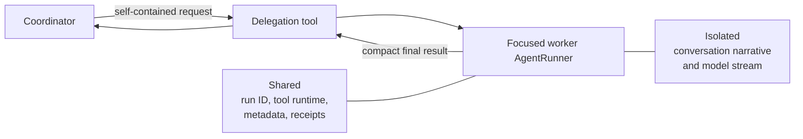

The worker cannot see the parent's transcript. Its lifecycle and usage remain visible, but its
token stream and assistant messages are filtered so they do not become the parent's answer.
Delegation is currently a nested, synchronous tool call rather than an independently scheduled
child run.

## 9. Events and frontend reconstruction

Events are the execution-to-UI contract, not merely logs.

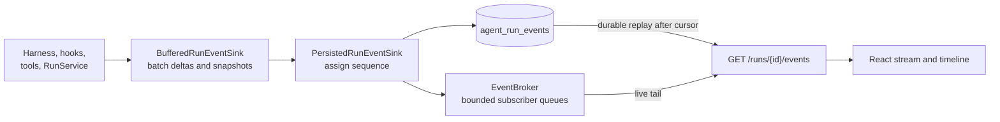

Every event has a monotonically increasing sequence number. The browser de-duplicates by sequence.
On connection, the API subscribes to the broker, replays durable events, catches up from broker
history, and then tails live events. A lagging subscriber disconnects and can resume from its last
durable cursor.

The same event list reconstructs:

- streamed answer text and reasoning;
- tool calls, results, failures, and durations;
- delegated-agent lifecycle;
- context compaction;
- usage and run terminal state.

## 10. Durability, epochs, and recovery

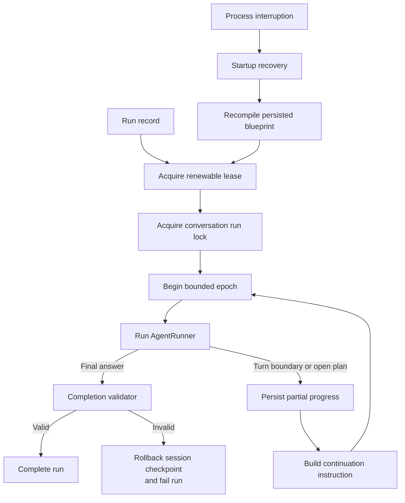

Durable run state is intentionally redundant:

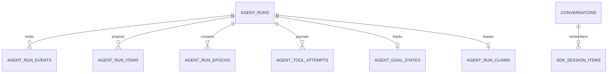

- **Run row:** status, input, blueprint, output, usage, runtime metadata.
- **Events:** durable chronological UI and diagnostic stream.
- **Items:** transcript-oriented projections.
- **Epochs:** bounded execution segments and continuation points.
- **Tool attempts:** retries, failures, result references, and uncertain writes.
- **Goal state:** Deep Work plan.
- **Claim:** current execution task and lease expiry for interruption recovery, not user ownership.
- **Session items:** canonical cross-turn conversation history.

Recovery starts a new epoch from durable facts. It does not attempt to deserialize a suspended
coroutine or resume a partially received model stream.

## 11. Context management

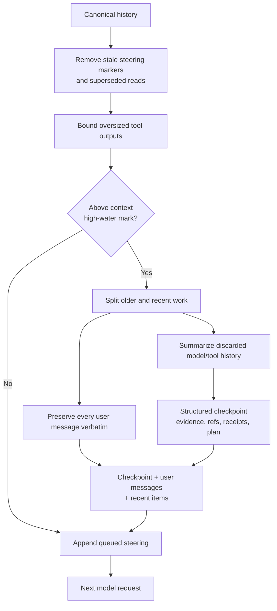

Compaction occurs only between complete model/tool rounds. The compacted list becomes the runner's
new working context, while generated items remain available for durable history.

## 12. Research data pipeline

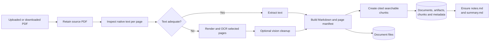

The principal document entities are:

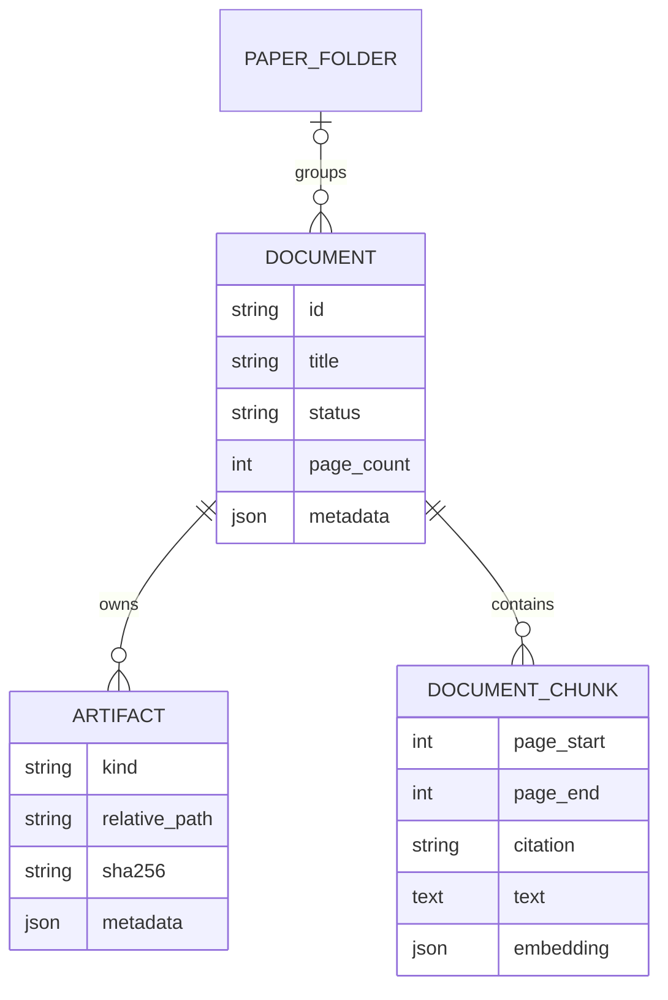

Folder assignment changes document metadata only; it does not move source PDFs or workspace files.
All user-controlled paths pass through `SafeStorage` or `WorkspaceService`.

## 13. Deterministic safety and completion controls

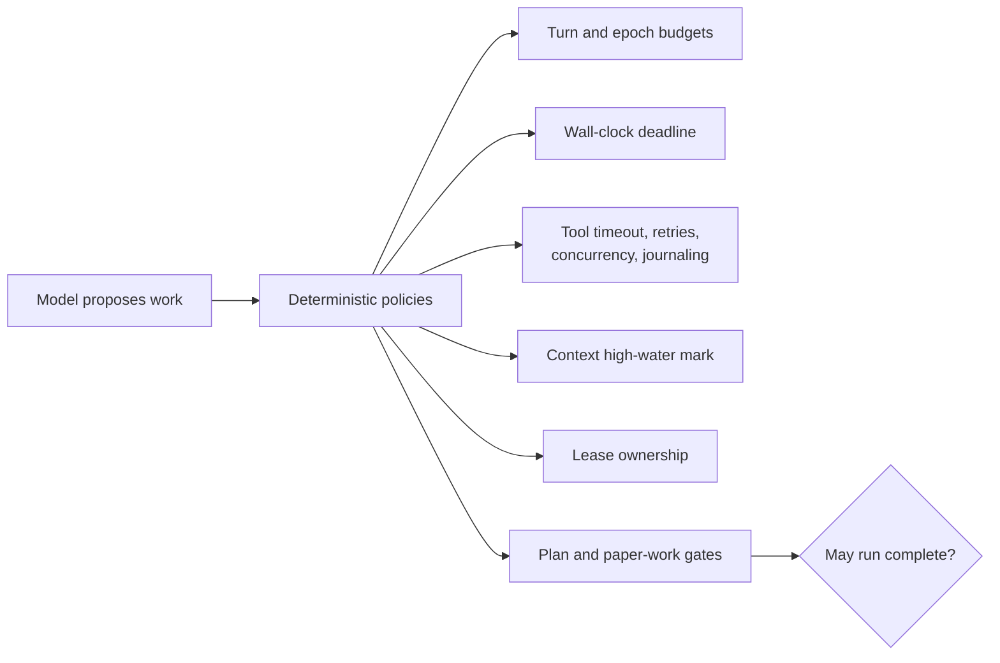

A model saying “done” is not sufficient when a completion policy applies. Paper-based work must
show the required read/extraction, cited summary, and durable notes activity. Deep Work must also
close or block every tracked work item.

## 14. Extension map

| Change | Primary extension point |
|---|---|
| Add an HTTP endpoint | Feature router, schema, service, generated OpenAPI client |
| Add a model-callable tool | Tool catalog, runtime handler, model-visible prompt guidance |
| Change Research or Deep Work composition | Blueprint builders in `conversations/turns.py` |
| Add a provider kind | Provider schemas/runtime/model resolver |
| Change model-loop behavior | Native harness |
| Change run durability or recovery | Run service, repository, and run models |
| Add an event type | Backend producer and frontend `RUN_EVENT_TYPES` |
| Change context compaction | Context budget policy |
| Change paper ingestion | Document ingestion/OCR/vision pipeline |
| Add a user-visible research artifact | Domain service plus `SafeStorage` or `WorkspaceService` |

## 15. Architectural invariants

1. Routers call services; only repositories open ORM sessions.
2. All research data implicitly belongs to one local researcher; do not add collaboration or
   tenancy layers.
3. The application uses one process-scoped service graph.
4. The native harness owns the model/tool loop; domain behavior stays behind tools.
5. Canonical conversation items remain provider-neutral.
6. Persist events before publishing them.
7. Treat SQLite and guarded files as the durable recovery boundary.
8. Never write user-facing paths outside `SafeStorage` or `WorkspaceService`.
9. Do not run multiple Uvicorn workers without replacing the in-memory control plane.
10. Keep event names synchronized with the frontend subscriber.
11. Let deterministic completion policies—not model confidence—decide whether constrained work is
    complete.
